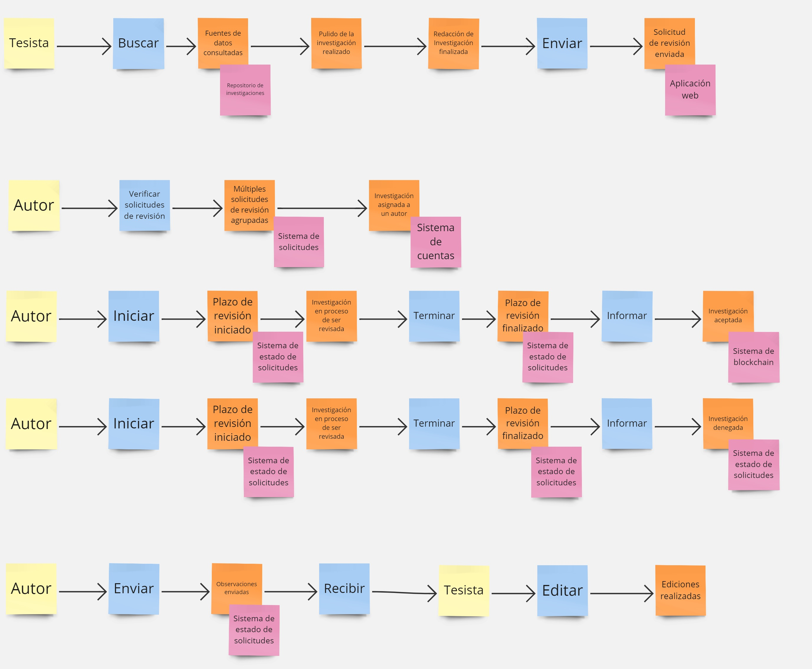
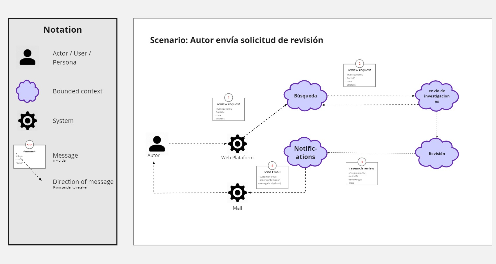
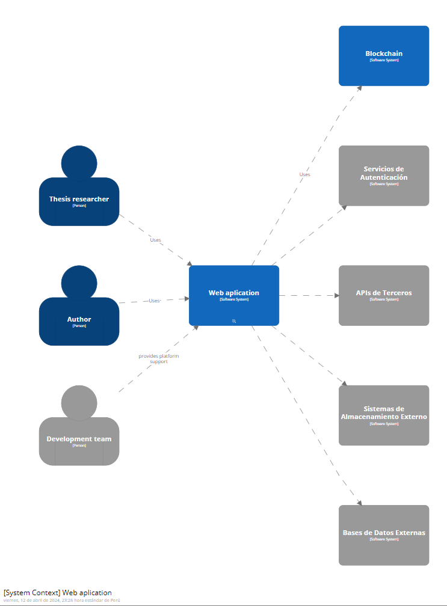
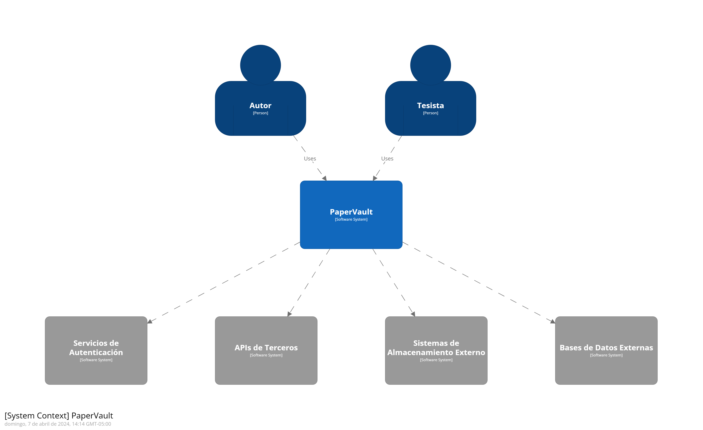

# Strategic-Level Attribute-Driven Design.

## Design Purpose

En PaperVault, nuestra solución se centra en ofrecer seguridad en cuanto a la autoría de los trabajos publicados por nuestros usuarios. Otro de nuestros objetivos es crear un entorno acogedor y dinámico donde investigadores, estudiantes y profesionales puedan publicar, buscar e interactuar de manera directa con investigaciones académicas. Queremos proporcionar una plataforma accesible para todos nuestros usuarios, facilitando la difusión y el descubrimiento de conocimiento. Al hacerlo, ayudamos a los investigadores a obtener el reconocimiento que merecen por sus contribuciones innovadoras al campo académico.

## Attribute-Driven Design Inputs

### Primary Functionality (Primary User Stories)

Se seleccionaron los user stories que cuentan con una mayor relevancia para la solución a desarrollar en el siguiente cuadro:

<table>
    <thead>
        <tr>
            <th>Epic / User Story ID</th>
            <th>Título</th>
            <th>Criterios de Aceptación</th>
            <th>Relacionado con (Epic ID)</th>
        </tr>
    </thead>
    <tbody>
        <tr>
            <td>US07</td>
            <td>Buscar por palabras clave</td>
            <td>
                <b>Scenario 1:</b> Aplicación de filtros por palabra clave  
                <b>Dada</b> una búsqueda en la plataforma  
                <b>Cuando</b> el usuario ingresa palabras clave  
                <b>Y</b> presiona el boton de buscar  
                <b>Entonces</b> se muestran las publicaciones que contengan dichas palabras.
            </td>
            <td>EP02</td>
        </tr>
        <tr>
            <td>US08</td>
            <td>Filtrar resultados por fecha</td>
            <td>
                <b>Scenario 1:</b> Aplicación de filtros por fecha de publicación  
                <b>Dada</b> una búsqueda realizada en la plataforma  
                <b>Cuando</b> el usuario selecciona un rango de fechas  
                <b>Y</b> presiona el botón de filtrar  
                <b>Entonces</b> se muestran las publicaciones con fechas dentro del rango establecido.
            </td>
            <td>EP02</td>
        </tr>
        <tr>
            <td>US12</td>
            <td>Leer paper completo</td>
            <td>
                <b>Scenario 1:</b> Redirección a página de publicación  
                <b>Dada</b> una publicación seleccionada  
                <b>Cuando</b> el usuario selecciona la opción de leer el paper completo  
                <b>Entonces</b> se redirige a la página de publicación original.  
            </td>
            <td>EP02</td>
        </tr>
        <tr>
            <td>US14</td>
            <td>Subir investigación</td>
            <td>
                <b>Scenario 1:</b> Archivo cargado correctamente 
                <b>Dado que</b> el tesista selecciona la opción "Subir Investigación" desde el menú principal 
                <b>Y</b> completa los campos requeridos, como título, autores, resumen y palabras clave 
                <b>Cuando</b> adjunta el archivo de investigación 
                <b>Y</b> confirma la carga de la investigación para su revisión  
                <b>Entonces</b> recibe una confirmación del sistema de que la investigación ha sido enviada correctamente.
                  
                <b>Scenario 2:</b> Archivo no válido  
                <b>Dado que</b> el tesista adjunta el archivo de investigación para solicitar su revisión 
                <b>Cuando</b> el tesista intenta confirmar la carga de su investigación 
                <b>Entonces</b> El sistema muestra un mensaje de error indicando que el archivo no es válido y solicita al usuario que seleccione un archivo compatible.
            </td>
            <td>EP03</td>
        </tr>
        <tr>
            <td>US18</td>
            <td>Herramientas de detección de plagio</td>
            <td>
                <b>Scenario 1:</b> Acceso a Herramientas de Detección de Plagio  
                <b>Dado que</b> soy un autor registrado en la plataforma  
                <b>Cuando</b> subo un trabajo de investigación para su verificación de originalidad mediante la herramienta de detección de plagio  
                <b>Entonces</b> el sistema debería procesar el documento y proporcionar un informe detallado sobre cualquier similitud encontrada con otros trabajos existentes.
            </td>
            <td>EP03</td>
        </tr>
        <tr>
            <td>US22</td>
            <td>Seguimiento del proceso</td>
            <td>
                <b>Scenario 1:</b> Estado de Revisión Actualizado 
                <b>Dado que</b> el tesista se encuentra en la sección "Mis Investigaciones" 
                <b>Cuando</b> selecciona la opción "Seguimiento" de una de las  investigaciones enviadas 
                <b>Entonces</b> encuentra que el estado de revisión de su investigación ha sido actualizado.
                  
                <b>Scenario 2:</b> Revisión Completada 
                <b>Dado que</b> el tesista recibe una notificación de que el proceso de revisión de su investigación ha sido completado 
                <b>Cuando</b> selecciona la opción "Seguimiento" de su investigación 
                <b>Entonces</b> el tesista puede acceder a los comentarios y revisar el veredicto final emitido para su investigación.
            </td>
            <td>EP03</td>
        </tr>
        <tr>
            <td>US24</td>
            <td>Ver el nivel de las revistas en la plataforma</td>
            <td>
                <b>Scenario 1:</b> Visualización del nivel de revistas 
                <b>Dado que</b> seleccioné los artículos científicos que usaré, 
                <b>Cuando</b> busco la revista del articulo seleccionado 
                <b>Entonces</b> visualizo su nivel de forma clara y precisa.
            </td>
            <td>EP04</td>
        </tr>
        <tr>
            <td>US29</td>
            <td>Acceder a métricas de impacto de trabajos académicos</td>
            <td>
                <b>Scenario 1:</b>Métricas de impacto 
                <b>Dado que</b> accedo a un trabajo académico, 
                <b>Cuando</b>  navego por las métricas de impacto, 
                <b>Entonces</b>  puedo ver estadísticas actualizadas sobre citas, descargas u otras métricas relevantes.
            </td>
            <td>EP02</td>
        </tr>
        <tr>
            <td>US30</td>
            <td>Roles y permisos</td>
            <td>
                <b>Scenario 1:</b> Ingreso a la plataforma como tesista 
                <b>Dado que</b> creé una cuenta como tesista 
                <b>Cuando</b> inicie sesión 
                <b>Entonces</b> tendré acceso a todas las funcionalidades de un tesista.
                  
                <b>Scenario 2:</b> Ingreso a la plataforma como Autor 
                <b>Dado que</b> creé una cuenta como autor 
                <b>Cuando</b> inicie sesión  
                <b>Entonces</b> tendré acceso a todas las funcionalidades de un autor.
            </td>
            <td>EP01</td>
        </tr>
        <tr>
            <td>US31</td>
            <td>Aceptación de la investigación</td>
            <td>
                <b>Scenario 1:</b> Confirmación exitosa 
                <b>Dado que</b> se ha terminado de revisar una investigación 
                <b>Cuando</b> el autor confirme la publicación del estudio 
                <b>Entonces</b> se muestra un mensaje indicando que el estudio ha sido almacenado en un repositorio académico de manera exitosa.
                  
                <b>Scenario 2:</b> Confirmación Pendiente 
                <b>Dado que</b> se ha terminado de revisar una investigación 
                <b>Cuando</b> el autor confirme la publicación del estudio 
                <b>Entonces</b> el sistema muestra un mensaje indicando que la investigación está en proceso de ser almacenada en el repositorio académico.
            </td>
            <td>EP01</td>
        </tr>
    </tbody>
</table>

### Quality Attribute Scenarios

<table>
    <thead>
        <tr>
            <th>ID</th>
            <th>Atributo</th>
            <th>Fuente</th>
            <th>Estímulo</th>
            <th>Artefacto</th>
            <th>Entorno</th>
            <th>Respuesta</th>
            <th>Medida</th>
        </tr>
    </thead>
    <tbody>
        <tr>
            <td>QA1</td>
            <td>Rendimiento</td>
            <td>Usuario</td>
            <td>Realiza una búsqueda de palabras clave</td>
            <td>Sistema de búsqueda</td>
            <td>Plataforma de investigación</td>
            <td>Mostrar resultados relevantes dentro de un tiempo razonable</td>
            <td>Tiempo de respuesta</td>
        </tr>
        <tr>
            <td>QA2</td>
            <td>Usabilidad</td>
            <td>Usuario</td>
            <td>Publicar paper</td>
            <td>Funcionalidad de carga de archivos</td>
            <td>Interfaz de usuario</td>
            <td>Permite al usuario seleccionar fácilmente un archivo y recibir retroalimentación clara sobre la carga exitosa o los errores de validación</td>
            <td>Tasa de éxito de carga, claridad de los mensajes de error</td>
        </tr>
        <tr>
            <td>QA4</td>
            <td>Fiabilidad</td>
            <td>Usuario</td>
            <td>Visualizar paper</td>
            <td>Motor de búsqueda interno</td>
            <td>Plataforma de investigación</td>
            <td>Proporciona acceso constante y confiable a los trabajos académicos sin errores de servidor o interrupciones inesperadas</td>
            <td>Disponibilidad del servicio, tiempo medio entre fallos</td>
        </tr>
        <tr>
            <td>QA5</td>
            <td>Mantenibilidad</td>
            <td>Humano</td>
            <td>Uso de la solución</td>
            <td>Sistema</td>
            <td>En ejecución</td>
            <td>Facilidad para realizar actualizaciones y mejoras en el sistema sin interrupciones significativas del servicio</td>
            <td>Tiempo de inactividad planificada menor a un segundo.</td>
        </tr>
        <tr>
            <td>QA6</td>
            <td>Escalabilidad</td>
            <td>Usuario</td>
            <td>Aplicación rápida</td>
            <td>Servidores de aplicación</td>
            <td>Entorno de producción</td>
            <td>El sistema maneja un aumento en la carga sin degradación del rendimiento</td>
            <td>Throughput, tiempo de respuesta bajo carga</td>
        </tr>
        <tr>
            <td>QA7</td>
            <td>Eficiencia de desempeño</td>
            <td>Humano</td>
            <td>Visualizar perfil</td>
            <td>Sistema</td>
            <td>En ejecución</td>
            <td>Tiempo de carga rápidde datos</td>
            <td>En menos de 5 segundos</td>
        </tr>
        <tr>
            <td>QA8</td>
            <td>Seguridad</td>
            <td>Humano</td>
            <td>Acceso a la aplicación</td>
            <td>Mecanismos de autenticación y autorización</td>
            <td>Entorno de producción</td>
            <td>La aplicación verifica las credenciales del usuario y garantiza que solo los usuarios autorizados puedan acceder a funcionalidades sensibles o datos confidenciales.</td>
            <td>Tasa de éxito en la autenticación, detección de intentos de acceso no autorizados.</td>
        </tr>
        <tr>
            <td>QA9</td>
            <td>Usabilidad</td>
            <td>Usuario</td>
            <td>Filtrar y ordenar papers</td>
            <td>Funcionalidad de filtrado y ordenamiento</td>
            <td>Interfaz de usuario</td>
            <td>Permite al usuario filtrar y ordenar los papers de manera intuitiva y eficiente, facilitando la búsqueda de información relevante.</td>
            <td>Tiempo necesario para filtrar y ordenar, facilidad de uso de las herramientas de filtrado y ordenamiento.</td>
        </tr>
        <tr>
            <td>QA10</td>
            <td>Usabilidad</td>
            <td>Usuario</td>
            <td>Escribir comentarios</td>
            <td>Funcionalidad de comentarios</td>
            <td>Interfaz de usuario</td>
            <td>Permite al usuario escribir comentarios de manera clara y sencilla, facilitando la comunicación y colaboración entre usuarios.</td>
            <td>Tiempo necesario para escribir comentarios, facilidad de uso del sistema de comentarios.</td>
        </tr>
    </tbody>
</table>

### Constraints

<table>
    <thead>
        <tr>
            <th>Technical Story ID</th>
            <th>Título</th>
            <th>Descripción</th>
            <th>Criterios de Aceptación</th>
            <th>Relacionado con (Epic ID)</th>
        </tr>
    </thead>
    <tbody>
        <tr>
            <td>TC01</td>
            <td>Topología de la Red</td>
            <td>La topología de red existente puede influir en la forma en que se despliega y accede a la aplicación.</td>
            <td>
                La arquitectura debe ser compatible con la topología de red existente de la empresa.
                Se deben considerar las limitaciones y requisitos de la infraestructura de red al diseñar la arquitectura de la aplicación.
            </td>
            <td>EP01, EP02, EP03, EP04</td>
        </tr>
        <tr>
            <td>TC02</td>
            <td>Base de Datos Existente o Proveedor de Base de Datos</td>
            <td>La elección de la tecnología de base de datos puede estar influenciada por la base de datos existente utilizada para otros fines dentro de la empresa.</td>
            <td>
                La arquitectura debe ser compatible con la base de datos existente utilizada para otros fines, como la gestión médica.
                Se debe seleccionar una tecnología de base de datos que sea compatible con la base de datos existente o el proveedor de base de datos preferido de la empresa.
            </td>
            <td>EP01, EP02, EP03, EP04</td>
        </tr>
        <tr>
            <td>TC03</td>
            <td>Entorno Web</td>
            <td>Las configuraciones de servidor, cortafuegos y medidas de seguridad en el entorno web son críticas para proteger los datos de los pacientes y garantizar la disponibilidad de la aplicación.</td>
            <td>
                La arquitectura debe respetar y considerar las configuraciones de servidor, cortafuegos y medidas de seguridad en el entorno web.
                Se deben implementar medidas de seguridad adecuadas para proteger los datos de los pacientes y garantizar la disponibilidad de la aplicación.
            </td>
            <td>EP01, EP02, EP03, EP04</td>
        </tr>
        <tr>
            <td>TC04</td>
            <td>Servidores</td>
            <td>Las restricciones en cuanto al modelo de hardware y sistema operativo utilizados por la empresa pueden influir en la selección de tecnologías y plataformas para desarrollar y desplegar la aplicación.</td>
            <td>
                La arquitectura debe ser compatible con el modelo de hardware y sistema operativo preferido o utilizado por la empresa.
                Se deben seleccionar tecnologías y plataformas que sean compatibles con el modelo de hardware y sistema operativo de los servidores de la empresa.
            </td>
            <td>EP01, EP02, EP03, EP04</td>
        </tr>
        <tr>
            <td>TC05</td>
            <td>Uso de Software de Terceros o Tecnologías Particulares</td>
            <td>La integración con software de terceros para funciones específicas puede ser una restricción que debe ser tenida en cuenta al diseñar la arquitectura de la aplicación.</td>
            <td>
                La arquitectura debe ser compatible con el uso de software de terceros o tecnologías particulares requeridas para funciones específicas.
                Se deben considerar las restricciones y requisitos de integración al seleccionar tecnologías y plataformas para desarrollar la aplicación.
            </td>
            <td>EP01, EP02, EP03, EP04</td>
        </tr>
        <tr>
            <td>TC06</td>
            <td>Cumplimiento de Normativas Existentes</td>
            <td>El cumplimiento de normativas de privacidad de datos y regulaciones de salud es una restricción crítica debido a la naturaleza médica de la aplicación.</td>
            <td>
                La arquitectura debe ser diseñada para cumplir con las normativas de privacidad de datos y regulaciones de salud aplicables.
                Se deben implementar medidas de seguridad y protección de datos para garantizar el cumplimiento de las normativas existentes.
            </td>
            <td>EP01, EP02, EP03, EP04</td>
        </tr>
        <tr>
            <td>TC07</td>
            <td>Seguridad de datos</td>
            <td>Se deben implementar medidas de seguridad para proteger los datos sensibles de los usuarios.</td>
            <td>
                Los datos de los usuarios se almacenan de forma cifrada en la base de datos.
                Se utilizan técnicas de encriptación para proteger la comunicación entre el cliente y el servidor.
                Se implementan políticas de acceso y autenticación para garantizar que solo los usuarios autorizados puedan acceder a datos sensibles.
            </td>
            <td>EP01, EP02, EP03, EP04</td>
        </tr>
        <tr>
            <td>TC08</td>
            <td>Disponibilidad del servicio</td>
            <td>La aplicación debe estar disponible para su uso la mayor parte del tiempo, minimizando cualquier tiempo de inactividad no planificado.</td>
            <td>
                El tiempo de inactividad no planificado de la aplicación no debe superar el 0.1% del tiempo total.
                Se implementan medidas de monitoreo para detectar y resolver rápidamente cualquier problema que afecte la disponibilidad del servicio.
                Se establece un plan de contingencia para garantizar una rápida recuperación en caso de fallas o interrupciones inesperadas.
            </td>
            <td>EP01, EP02, EP03, EP04</td>
        </tr>
        <tr>
            <td>TC09</td>
            <td>Escalabilidad</td>
            <td>La aplicación debe ser capaz de manejar un aumento significativo en la carga de usuarios y datos sin degradación del rendimiento.</td>
            <td>
                La aplicación puede manejar al menos el doble de usuarios concurrentes sin experimentar una disminución significativa en el rendimiento.
                Los tiempos de respuesta de la aplicación se mantienen dentro de rangos aceptables incluso bajo cargas de trabajo pesadas.
                Se implementan técnicas de escalado horizontal y vertical para distribuir la carga y mejorar la capacidad de respuesta del sistema.
            </td>
            <td>EP01, EP02, EP03, EP04</td>
        </tr>
        <tr>
            <td>TC10</td>
            <td>Respaldo de datos</td>
            <td>Se debe realizar regularmente el respaldo de los datos para prevenir pérdidas de información.</td>
            <td>
                Se realiza un respaldo completo de la base de datos al menos una vez al día.
                Se implementan procedimientos de respaldo incremental para minimizar el tiempo y los recursos necesarios para realizar copias de seguridad.
                Los datos de respaldo se almacenan en ubicaciones seguras y fuera del sitio para proteger contra desastres naturales y otros eventos catastróficos.
            </td>
            <td>EP01, EP02, EP03, EP04</td>
        </tr>
        <tr>
            <td>TC11</td>
            <td>Escalabilidad del equipo de desarrollo</td>
            <td>El equipo de desarrollo debe ser capaz de adaptarse y escalar según las necesidades del proyecto.</td>
            <td>
                El equipo de desarrollo puede expandirse o contraerse según los requisitos del proyecto, manteniendo al mismo tiempo la productividad y la calidad del trabajo.
                Se implementan prácticas ágiles y flexibles para facilitar la incorporación de nuevos miembros al equipo y la distribución eficiente de tareas.
                Se establecen procesos de comunicación efectivos para garantizar una colaboración fluida entre los miembros del equipo, incluso en entornos distribuidos o remotos.
            </td>
            <td>EP01, EP02, EP03, EP04</td>
        </tr>
        <tr>
            <td>TC12</td>
            <td>Documentación</td>
            <td>Se debe mantener una documentación detallada y actualizada del sistema y su funcionamiento.</td>
            <td>
                Se documentan los requisitos del sistema, incluidas las funcionalidades, las interfaces, y los casos de uso.
                Se proporciona documentación técnica para los desarrolladores, incluyendo diagramas de arquitectura, bases de datos, y flujos de datos.
                Se genera documentación de usuario para ayudar a los usuarios finales a comprender y utilizar eficazmente la aplicación.
            </td>
            <td>EP01, EP02, EP03, EP04</td>
        </tr>
    </tbody>
</table>

## Architectural Drivers Backlog

<table>
    <thead>
        <tr>
            <th>Driver ID</th>
            <th>Título de Driver</th>
            <th>Descripción</th>
            <th>Importancia para Stakeholders (High, Medium, Low)</th>
            <th>Impacto en Architecture Technical Complexity (High, Medium, Low)</th>
        </tr>
    </thead>
    <tbody>
        <tr>
            <td>D1</td>
            <td>Publicar paper</td>
            <td>Como investigador quiero publicar mis papers en la blockchain para evitar mantener la integridad de mis trabajos</td>
            <td>High</td>
            <td>High</td>
        </tr>
        <tr>
            <td>D2</td>
            <td>Visualizar paper</td>
            <td>Como tesista quiero visualizar papers para tenerlas como referencias en mi tesis</td>
            <td>High</td>
            <td>High</td>
        </tr>
        <tr>
            <td>D3</td>
            <td>Guardar papers</td>
            <td>Como tesista quiero guardar papers para tenerlas en la mano cuando lo necesite</td>
            <td>High</td>
            <td>Medium</td>
        </tr>
        <tr>
            <td>D4</td>
            <td>Buscar papers</td>
            <td>Como tesistas quiero buscar papers con palabras claves para encontrar los papers relacionados con mi tema de investigación</td>
            <td>High</td>
            <td>Medium</td>
        </tr>
        <tr>
            <td>D5</td>
            <td>Aplicación rápida</td>
            <td>Como usuario quiero que la aplicación sea rápida para no perder tiempo en cargas lentas</td>
            <td>High</td>
            <td>Medium</td>
        </tr>
        <tr>
            <td>D6</td>
            <td>Seguridad en la aplicación</td>
            <td>Como usuario quiero que la aplicación sea segura para evitar hackeos y filtraciones de datos</td>
            <td>High</td>
            <td>Medium</td>
        </tr>
        <tr>
            <td>D7</td>
            <td>Filtrar papers por año</td>
            <td>Como tesista quiero filtrar papers por año para obtener los papers de los años que necesito</td>
            <td>Medium</td>
            <td>Low</td>
        </tr>
        <tr>
            <td>D8</td>
            <td>Ordenar papers por rating</td>
            <td>Como tesista quiero ordenar los resultados por rating para visualizar los mejores papers por la comunidad</td>
            <td>Medium</td>
            <td>Low</td>
        </tr>
        <tr>
            <td>D9</td>
            <td>Visualizar perfil</td>
            <td>Como investigador quiero tener un perfil para que puedan ver mi trayectoria y me puedan contactar</td>
            <td>Low</td>
            <td>Low</td>
        </tr>
        <tr>
            <td>D10</td>
            <td>Escribir comentarios</td>
            <td>Como tesista quiero escribir comentarios en los papers para dar una opinión personal a la comunidad</td>
            <td>Low</td>
            <td>Low</td>
        </tr>
    </tbody>
</table>

## Architectural Design Decisions

<table>
    <thead>
        <tr>
            <th rowspan=2>Driver ID</th>
            <th rowspan=2>Título del driver</th>
            <th colspan=2>Factory Method</th>
            <th colspan=2>Decorator</th>
            <th colspan=2>Singleton</th>
        </tr>
        <tr>
            <th>Pro</th>
            <th>Con</th>
            <th>Pro</th>
            <th>Con</th>
            <th>Pro</th>
            <th>Con</th>
        </tr>
    <thead>
    <tbody>
        <tr>
            <td>D1</td>
            <td>Publicar paper</td>
            <td>Permite publicar papers sin preocuparse en la implementación exactos</td>
            <td>Complicación si existe sobrecarga de clases</td>
            <td>Puede desarrollar nuevas funcionalidades sin modificar el código existente</td>
            <td>Dificultad para especificar funcionalidades específicas</td>
            <td>Facilita la gestión de recursos entre la apalicación y el blockchain</td>
            <td>Genera un acoplamiento fuerte entre los componentes</td>
        </tr>
        <tr>
            <td>D2</td>
            <td>Visualizar paper</td>
            <td>Reusabilidad del código</td>
            <td>Existe una complejidad inicial al implementar el patrón</td>
            <td>Reusar código para distintos tipos de visualización</td>
            <td>Pérdida de rendimiento al haber mayor número de objetos involucrados</td>
            <td>Acceso centralizado a una instancia para visualizar un paper</td>
            <td>Es complejo para adaptar cambios en un futuro</td>
        </tr>
        <tr>
            <td>D3</td>
            <td>Guardar papers</td>
            <td>Facilidad en la creación de nuevas implementaciones</td>
            <td>Posible problemas de rendimiento</td>
            <td>Agregar distintas funcionalidades sin alterar el código base</td>
            <td>Al agregar varios objetos, puede haber una sobrecarga de memoria</td>
            <td>Garantiza que haya una sola clase para guardar papers</td>
            <td>Limitación en cuanto a cambios o nuevas funcionalidades</td>
        </tr>
        <tr>
            <td>D4</td>
            <td>Buscar papers</td>
            <td>Permite manejar distintos tipos de búsqueda sin necesidad de modificar el código</td>
            <td>Aumenta la complejidad de mantenimiento de la funcionalidad</td>
            <td>Crear diferentes decoradores para buscar mediante distintos tipos de criterios</td>
            <td>Tiempo de carga alta al haber más objetos involucrados</td>
            <td>Permite conservar el estado de la búsqueda</td>
            <td>Díficil de mantener</td>
        </tr>
        <tr>
            <td>D5</td>
            <td>Aplicación rápida</td>
            <td>Mejora la modularidad y separa responsabilidades</td>
            <td>Puede agregar una complegidad innecesaria al proyecto</td>
            <td>Permite rapidez en el desarrollo de nuevas funcionalidades</td>
            <td>Es necesario diseñar correctamenta la arquitectura para evitar sobrecarga de objetos</td>
            <td>Optimiza los recursos del sistema</td>
            <td>Alto potencial en generar cuellos de botellas</td>
        </tr>
        <tr>
            <td>D6</td>
            <td>Seguridad en la aplicación</td>
            <td>Permite centralizar la gestión de seguridad en un solo lugar</td>
            <td>El fallo en la implementación del patrón puede exponer a vulneerabilidades</td>
            <td>Se puede aumentar capas de seguridad mediante decoradores</td>
            <td>Requiere una complejidad adicional para el desarrollo</td>
            <td>Permite implementar la seguridad en una sola clase</td>
            <td>Si una clase se ve compromentida, puede dañar gran parte de la aplaicación</td>
        </tr>
        <tr>
            <td>D7</td>
            <td>Filtrar papers por año</td>
            <td>Reutilizar el código y evitar la duplicidad</td>
            <td>Sobrecarga de clases</td>
            <td>Crear nuevos criterios de filtrado fácilmente</td>
            <td>Alto potencial en tener complejidad excesiva</td>
            <td>Evita incosistencia de resultados</td>
            <td>Limita la escabilidad cuando hay una mayor cantidad de criterios</td>
        </tr>
        <tr>
            <td>D8</td>
            <td>Ordenar papers por rating</td>
            <td>Ayuda a la separación de responsabilidades</td>
            <td>Si la cantidad de papers es amplia, puede haber problemas de rendimiento</td>
            <td>Promueve la modularidad, lo que es más fácil de mantener y entender</td>
            <td>Si hay muchos criterios, puede generar una sobrecarga</td>
            <td>Centralizar el proceso de ordenación para la correcta gestión</td>
            <td>Si hay muchos criterios, se limita su escalabilidad</td>
        </tr>
        <tr>
            <td>D9</td>
            <td>Visualizar perfil</td>
            <td>Permite flexibilidad en caso ocurra cambios en los requisitos</td>
            <td>Puede agregar complejidad en el proyecto si los beneficios no son relevantes</td>
            <td>Permite agregar o modificar componentes visuales fácilmente</td>
            <td>Aumenta la complejidad de la arquitectura de la aplicación</td>
            <td>Consistencia de los datos</td>
            <td>Alto acoplamiento de la aplicación</td>
        </tr>
        <tr>
            <td>D10</td>
            <td>Escribir comentarios</td>
            <td>Abstrae la lógica de negocio de los comentarios</td>
            <td>Se pueden crear varias clases para distintos tipo, lo que genera en una sobrecarga.</td>
            <td>Permite la separación de responsabilidades</td>
            <td>El exceso de decoradores repercute en el rendimiento</td>
            <td>Optimización de recursos al evitar crear objetos innecesarios</td>
            <td>Dificultad para la concurrencia</td>
        </tr>
    </tbody>
</table>

## Quality Attribute Scenario Refinements

<table> 
<tr> <strong>Scenario Refinement for Scenario 1 <strong> </tr> 
<tr> <td>Scenario(s):</td> 
    <td>Durante períodos de alta demanda, como lanzamientos de nuevas publicaciones, la plataforma debe mantenerse disponible con una disponibilidad del 99.5%, para garantizar que los usuarios puedan acceder a la información crítica en todo momento. </td> </tr> 
<tr> <td>Business Goals:</td> <td>Garantizar que los usuarios puedan acceder a la plataforma en todo momento</td> </tr> 
<tr> <td>Relevant Quality Attributes:</td> <td>Fiabilidad, Escalabilidad</td> </tr> 
<tr> <td>Stimulus:</td> <td>Aumento repentino en la demanda de usuarios</td> </tr> 
<tr> <th>Scenario Components</th> <th></th> 
<tr> <td>Stimulus Source:</td> <td>Incremento en el tráfico de la plataforma debido a la participación masiva</td> </tr> 
<tr> <td>Environment:</td> <td>La plataforma escala automáticamente sus recursos de servidor para manejar el aumento de tráfico, garantizando una disponibilidad del 99.5% y evitando la interrupción del servicio.</td> </tr> 
<tr> <td>Artifact (if Known):</td> <td>Proceso en BackEnd</td> </tr> 
<tr> <td>Response:</td> <td>La plataforma escala automáticamente</td> </tr> 
<tr> <td>Response Measure:</td> <td> menos de 5 segundo</td> </tr> 
</tr> 
<tr> <th>Questions:</th> <td>¿El sistema respondió eficazmente al aumento repentino en el tráfico? ¿La disponibilidad de la plataforma se mantuvo dentro del rango objetivo durante el evento?</td> </tr> 
<tr> <td>Issues:</td> <td>La disponibilidad del sistema puede verse comprometida durante picos de tráfico inesperados, especialmente para usuarios con conexiones de red inestables.</td> </tr> 
</table>

  

<table> 
<tr> Scenario Refinement for Scenario 2 </tr> 
<tr> <td>Scenario(s):</td> <td> Durante la búsqueda de publicaciones académicas, el sistema debe ser capaz de procesar y mostrar resultados relevantes en menos de 3 segundos, garantizando así una experiencia de usuario rápida y eficiente. </td> </tr> 
<tr> <td>Business Goals:</td> <td>Asegurar que los usuarios puedan acceder y revisar las publicaciones académicas de manera rápida y eficiente. </td> </tr> 
<tr> <td>Relevant Quality Attributes:</td> <td> Rendimiento</td> </tr> 
<tr> <td>Stimulus:</td> <td> Usuario realiza una búsqueda</td> </tr> 
<tr> <th>Scenario Components</th> <th></th> </tr> 
<tr> <td>Stimulus Source:</td> <td>Interacción del usuario con la función de búsqueda de la plataforma.</td> </tr> 
<tr> <td>Environment:</td> <td>La plataforma está experimentando un volumen típico de tráfico de usuarios que realizan búsquedas de publicaciones académicas.</td> </tr> 
<tr> <td>Artifact (if Known):</td> <td></td> </tr> 
<tr> <td>Response:</td> <td>El sistema procesa y muestra los resultados de la búsqueda de manera rápida</td> </tr> 
<tr> <td>Response Measure:</td> <td>menor o igual a 3 segundos</td> </tr> 
<tr> <th>Questions:</th> <th>¿El sistema es capaz de mantener un tiempo de respuesta por debajo de los 3 segundos incluso durante periodos de carga pico? ¿Cómo afecta el rendimiento del sistema a la satisfacción del usuario y la retención?</th> </tr> 
<tr> <td>Issues:</td> <td>Posibles retrasos en el procesamiento de búsqueda debido a la carga del servidor</td> </tr> 
</table>

  

<table> 
<tr> Scenario Refinement for Scenario 3 </tr> 
<tr> <td>Scenario(s):</td> <td>Cuando un investigador aplica filtros de búsqueda como año de publicación y tema para refinar los resultados de búsqueda, el sistema debe procesar y aplicar los filtros seleccionados en menos de 1 segundo, actualizando los resultados de búsqueda de acuerdo con los criterios establecidos. </td> </tr> 
<tr> <td>Business Goals:</td> <td>Permitir a los usuarios refinar y personalizar los resultados de búsqueda para encontrar rápidamente la información relevante</td> </tr> 
<tr> <td>Relevant Quality Attributes:</td> <td>Eficiencia de desempeño, Rendimiento, Usabilidad</td> </tr> 
<tr> <td>Stimulus:</td> <td>Usuario aplica filtros de búsqueda como año de publicación y tema.</td> </tr> 
<tr> <th>Scenario Components</th> <th></th> </tr> 
<tr> <td>Stimulus Source:</td> <td> Interacción del usuario con las opciones de filtro de búsqueda </td> </tr> 
<tr> <td>Environment:</td> <td>La plataforma está experimentando un flujo constante de usuarios que aplican filtros</td> </tr> 
<tr> <td>Artifact (if Known):</td> <td>Proceso en BackEnd
</td> </tr> 
<tr> <td>Response:</td> <td>El sistema procesa y aplica los filtros seleccionados por el usuario de manera rápida y precisa, actualizando los resultados de búsqueda de acuerdo con los criterios establecidos en menos de 1 segundo.</td> </tr> 
<tr> <td>Response Measure:</td> <td>menor o igual a 1 segundo</td> </tr> 
<tr> <th>Questions:</th> <th>¿El sistema puede manejar múltiples filtros aplicados simultáneamente sin experimentar retrasos significativos?</th> </tr> 
<tr> <td>Issues:</td> <td>Posibles demoras en la respuesta al aplicar filtros debido a la complejidad de las consultas</td> </tr> 
</table>

  

<table> 
<tr> Scenario Refinement for Scenario 4 </tr> 
<tr> <td>Scenario(s):</td> <td>Cuando un autor desea subir un artículo de investigación a la plataforma, el sistema debe procesar y almacenar el documento en menos de 5 segundos, garantizando la integridad y seguridad de los datos. </td> </tr> 
<tr> <td>Business Goals:</td> <td>Facilitar a los usuarios la carga eficiente de sus investigaciones a la plataforma</td> </tr> 
<tr> <td>Relevant Quality Attributes:</td> <td>Rendimiento, Seguridad.</td> </tr> 
<tr> <td>Stimulus:</td> <td>El investigador selecciona el archivo de investigación y hace clic en el botón de carga en la plataforma.</td> </tr> 
<tr> <th>Scenario Components</th> <th></th> </tr> 
<tr> <td>Stimulus Source:</td> <td>Interacción del usuario con la función de carga de la plataforma.</td> </tr> 
<tr> <td>Environment:</td> <td>La plataforma está en un estado normal de tráfico, con varios usuarios realizando acciones simultáneas.</td> </tr> 
<tr> <td>Artifact (if Known):</td> <td>Proceso en BackEnd</td> </tr> 
<tr> <td>Response:</td> <td>El sistema procesa y almacena el archivo de investigación en menos de 5 segundos, asegurando que la información esté disponible y segura en la plataforma.</td> </tr> 
<tr> <td>Response Measure:</td> <td> menor o igual a 5 segundos</td> </tr> 
<tr> <th>Questions:</th> <th>¿El sistema es capaz de mantener un tiempo de carga de archivos por debajo de los 5 segundos incluso durante picos de tráfico?</th> </tr> 
<tr> <td>Issues:</td> <td>Posibles retrasos en la carga debido a la capacidad del servidor o la velocidad de la conexión a Internet del usuario. </td> </tr> 
</table>

  

# Strategic-Level Domain-Driven Design

## Event Storming

## Candidate Context Discovery

## Domain Message Flows Modeling

 El Domain Message Flows Modeling para el escenario "Autor envía solicitud de revisión" describe la interacción entre los actores principales: el autor y el revisor. El autor hace uso del servicio de busquedas para mejorar su investigacion y envía una solicitud a otro autor para revisar su artículo. El autor analiza el articulo y proporciona los comentarios respectivos. Finalmente, el sistema comunica al autor la decisión final sobre la aceptación del artículo para su publicación.

 

## Bounded Context Canvases

## Context Mapping

# Software Architecture

## Software Architecture System Landscape Diagram

 

## Software Architecture Context Level Diagrams

## Software Architecture Container Level Diagrams

## Software Architecture Deployment Diagrams

