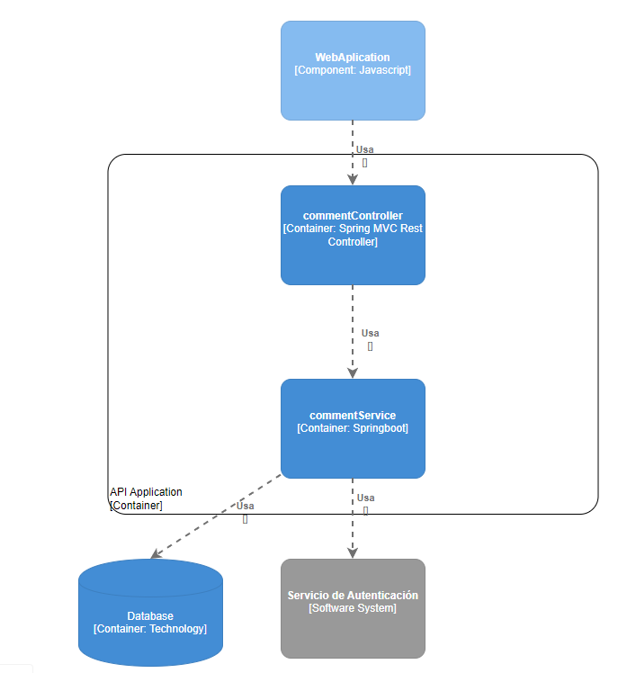
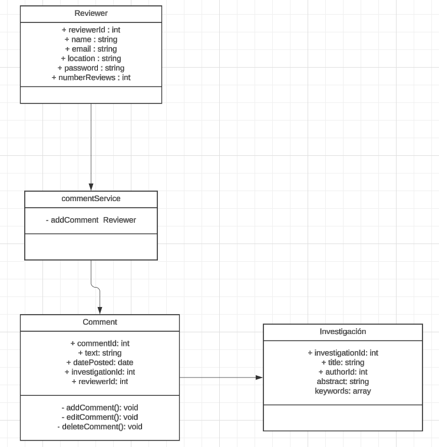
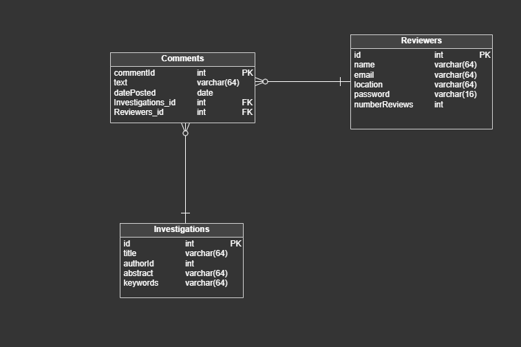
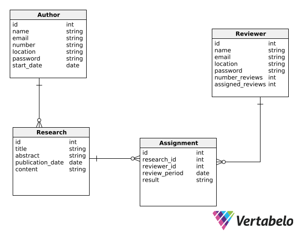

# Bounded Context: Plazo de revisión
## Domain Layer

<table>
  <tr>
    <td colspan="2" style="font-weight: bold;">Nombre</td>
    <td colspan="2">Investigación</td>
  </tr>
  <tr>
    <td colspan="2" style="font-weight: bold;">Categoría</td>
    <td colspan="2">Entity</td>
  </tr>
  <tr>
    <td colspan="2" style="font-weight: bold;">Propósito</td>
    <td colspan="2">bounded context engloba el comportamiento de multiples entidades y objetos.</td>
  </tr>
  <tr>
    <td colspan="4" style="text-align: center; font-weight: bold;">Atributos</td>
  </tr>
  <tr>
    <td style="font-weight: bold;">Nombre</td>
    <td style="font-weight: bold;">Tipo de dato</td>
    <td style="font-weight: bold;">Visibilidad</td>
    <td style="font-weight: bold;">Descripción</td>
  </tr>
  <tr>
    <td>Title</td>
    <td>String</td>
    <td>private</td>
    <td>Título de la investigación</td>
  </tr>
  <tr>
    <td>Author</td>
    <td>String</td>
    <td>private</td>
    <td>El autor de la investigación</td>
  </tr>
  <tr>
    <td>dateSent</td>
    <td>Date</td>
    <td>public</td>
    <td>La fecha en que se envió la investigación.</td>
  </tr>
  <tr>
    <td>reviewStatus</td>
    <td>ReviewStatus</td>
    <td>public</td>
    <td>El estado de revisión de la investigación</td>
  </tr>
  <tr>
    <td colspan="4" style="text-align: center;font-weight: bold;">Métodos</td>
  </tr>
  <tr>
    <td style="font-weight: bold;">Nombre</td>
    <td style="font-weight: bold;">Tipo de retorno</td>
    <td style="font-weight: bold;">Visibilidad</td>
    <td style="font-weight: bold;">Descripción</td>
  </tr>
  <tr>
    <td>getReviewStatus</td>
    <td>ReviewStatus</td>
    <td>public</td>
    <td>Método para obtener el estado de la revisión actual.</td>
  </tr>
  <tr>
    <td>setReviewStatus</td>
    <td>void</td>
    <td>public</td>
    <td>Método para asignar o actualizar el estado de revisión de una investigación.</td>
  </tr>
</table>

## Interface Layer

**RevisiónController**: Es el controlador encargado de manejar las solicitudes relacionadas con la gestión de los plazos de revisión, como la creación, actualización y eliminación de plazos de revisión, así como la notificación de progreso al usuario.

**NotificacionService**: Es el servicio encargado de enviar notificaciones a los usuarios sobre el progreso de la revisión de sus investigaciones. Este servicio recibirá eventos de progreso de revisión y envía notificaciones a los usuarios correspondientes.

**PlazoRevisionDTO**: Un objeto de transferencia de datos (DTO) que encapsula la información necesaria para mostrar los detalles de un plazo de revisión en la interfaz de usuario. Este DTO incluirá campos como la fecha de inicio, la fecha límite, el estado de progreso, etc.

**FormularioCreacionPlazoRevision**: Un formulario de entrada que permite a los usuarios crear nuevos plazos de revisión. Este formulario estará representado por una clase que maneja la validación y el envío de los datos del formulario al controlador correspondiente.

## Application Layer

**CrearPlazoRevisionCommandHandler**: Se encarga de procesar solicitudes para crear nuevos plazos de revisión. Este handler tomaría un comando de creación de plazo de revisión como entrada y realizaría las validaciones necesarias antes de persistir el nuevo plazo de revisión en el sistema.

**ActualizarPlazoRevisionCommandHandler**: Un handler de comandos encargado de procesar solicitudes para actualizar los plazos de revisión existentes. Este handler tomaría un comando de actualización de plazo de revisión como entrada y realizaría las validaciones necesarias antes de actualizar el estado del plazo de revisión en el sistema.

**EliminarPlazoRevisionCommandHandler**: Un manejador de comandos encargado de procesar solicitudes para eliminar plazos de revisión existentes. Este manejador tomaría un comando de eliminación de plazo de revisión como entrada y realizaría las validaciones necesarias antes de eliminar el plazo de revisión del sistema.

**NotificarProgresoEventHandler**: Un handler de eventos encargado de procesar eventos relacionados con el progreso de la revisión de investigaciones. Este handler escuchará eventos de progreso de revisión y enviaría notificaciones a los usuarios correspondientes sobre el estado actual de sus investigaciones.

## Infrastructure Layer

**PlazoRevisionRepository**: Clase encargada de interactuar con la base de datos para realizar operaciones de persistencia relacionadas con los plazos de revisión.

**NotificacionEmailService**: Esta clase se encargará de enviar notificaciones por correo electrónico a los usuarios sobre el progreso de la revisión de sus investigaciones. Esta clase utilizará un servicio externo de correo electrónico para enviar los correos electrónicos correspondientes.

**DatabaseConnection**: Una clase encargada de establecer conexiones con la base de datos y proporcionar instancias de conexiones para ser utilizadas por los repositorios y otras clases que necesiten acceder a la base de datos.

## Bounded Context Software Architecture Component Level Diagrams

## Bounded Context Software Architecture Code Level Diagrams
### Bounded Context Domain Layer Class Diagrams

### Bounded Context Database Design Diagram

# Bounded Context: Envío de investigaciones
## Domain Layer
<table>
  <tr>
    <td colspan="2" style="font-weight: bold;">Nombre:</td>
    <td colspan="2">SendInvestigationAggregate</td>
  </tr>
  <tr>
    <td colspan="2" style="font-weight: bold;">Categoría:</td>
    <td colspan="2">Aggregate</td>
  </tr>
  <tr>
    <td colspan="2" style="font-weight: bold;">Propósito:</td>
    <td colspan="2">bounded context engloba el comportamiento de multiples entidades y objetos.</td>
  </tr>
  <tr>
    <td colspan="4" style="text-align: center; font-weight: bold;">Atributos</td>
  </tr>
  <tr>
    <td style="font-weight: bold;">Nombre</td>
    <td style="font-weight: bold;">Tipo de dato</td>
    <td style="font-weight: bold;">Visibilidad</td>
    <td style="font-weight: bold;">Descripción</td>
  </tr>
  <tr>
    <td>InvestigationID</td>
    <td>int</td>
    <td>private</td>
    <td>Un identificador único para cada investigación</td>
  </tr>
  <tr>
    <td>Title </td>
    <td>string</td>
    <td>private</td>
    <td>titulo de la investigacion</td>
  </tr>
  <tr>
    <td>Abstract</td>
    <td>string</td>
    <td>public</td>
    <td>El resumen de la investigación.</td>
  </tr>
  <tr>
    <td>Content </td>
    <td>string</td>
    <td>public</td>
    <td>el contenido de la investigacion</td>
  </tr>
  <tr>
    <td>Authors</td>
    <td>List< AuthorUse ></td>
    <td>public</td>
    <td>Una lista de autores asociados a la investigación. </td>
  </tr>
  <tr>
    <td>ReviewStatus (Enum)</td>
    <td>enum</td>
    <td>public</td>
    <td>El estado de revisión de la investigación (por ejemplo: PENDING, IN_PROGRESS, COMPLETED).</td>
  </tr>
  <tr>
    <td>Authenticated </td>
    <td>boolean</td>
    <td>public</td>
    <td>Un indicador de si la investigación ha sido autenticada como verídica.</td>
  </tr>
  <tr>
    <td>Reviewers </td>
    <td>List< AuthorUser></td>
    <td>private</td>
    <td>Una lista de revisores asignados a la investigación.</td>
  </tr>
  <tr>
    <td>SubmissionDate</td>
    <td>Date/td>
    <td>public</td>
    <td>La fecha en que se envió la investigación.</td>
  </tr>
  <tr>
    <td>SubmissionDate</td>
    <td>Date/td>
    <td>public</td>
    <td>La fecha en que se envió la investigación.</td>
  </tr>
  <tr>
    <td>LastModifiedDate</td>
    <td>Date/td>
    <td>public</td>
    <td>La fecha en que se hizo la ultima modificacion en la investigación.</td>
  </tr>
  <tr>
    <td colspan="4" style="text-align: center;font-weight: bold;">Métodos</td>
  </tr>
  <tr>
    <td style="font-weight: bold;">Nombre</td>
    <td style="font-weight: bold;">Tipo de retorno</td>
    <td style="font-weight: bold;">Visibilidad</td>
    <td style="font-weight: bold;">Descripción</td>
  </tr>
  <tr>
    <td>submitForReview</td>
    <td>void</td>
    <td>public</td>
    <td>Método para enviar la investigación para su revisión. Actualiza el estado de revisión a "PENDING" y registra la fecha de envío.</td>
  </tr>
  <tr>
    <td>assignReviewer</td>
    <td>void</td>
    <td>public</td>
    <td>Método para asignar un revisor a la investigación. Agrega al revisor a la lista de revisores.</td>
  </tr>
   <tr>
    <td>updateReviewStatus(Enum status)</td>
    <td>void</td>
    <td>public</td>
    <td>Método para actualizar el estado de revisión de la investigación.</td>
  </tr>
  <tr>
    <td>authenticate()</td>
    <td>void</td>
    <td>public</td>
    <td>Método para marcar la investigación como autenticada.</td>
  </tr>
  <tr>
    <td>deleteInvestigation()</td>
    <td>void</td>
    <td>public</td>
    <td>Método para eliminar la investigación.</td>
  </tr>
</table>

   

<table>
  <tr>
    <td colspan="2" style="font-weight: bold;">Nombre:</td>
    <td colspan="2">authorUser</td>
  </tr>
  <tr>
    <td colspan="2" style="font-weight: bold;">Categoría:</td>
    <td colspan="2">Entity</td>
  </tr>
  <tr>
    <td colspan="2" style="font-weight: bold;">Propósito:</td>
    <td colspan="2">Registro, inicio de sesión, gestión de perfil, gestión de roles y permisos.</td>
  </tr>
  <tr>
    <td colspan="4" style="text-align: center; font-weight: bold;">Atributos</td>
  </tr>
  <tr>
    <td style="font-weight: bold;">Nombre</td>
    <td style="font-weight: bold;">Tipo de dato</td>
    <td style="font-weight: bold;">Visibilidad</td>
    <td style="font-weight: bold;">Descripción</td>
  </tr>
  <tr>
    <td>authorUserId</td>
    <td>int</td>
    <td>private</td>
    <td>Identificador único del usuarioAutor</td>
  </tr>
  <tr>
    <td>Name</td>
    <td>string</td>
    <td>private</td>
    <td>Nombre del autor</td>
  </tr>
  <tr>
    <td>correo</td>
    <td>string</td>
    <td>private</td>
    <td>correo del usuario autor</td>
  </tr>
  <tr>
    <td>StartDatetime</td>
    <td>Datetime</td>
    <td>private</td>
    <td>Fecha de inicio en la plataforma</td>
  </tr>
  <tr>
    <td>Location</td>
    <td>Location</td>
    <td>private</td>
    <td>Ubicación del usuario autor</td>
  </tr>
  <tr>
    <td>password</td>
    <td>string</td>
    <td>private</td>
    <td>contraseña del usuario</td>
  </tr>
  <tr>
    <td>profession</td>
    <td>string</td>
    <td>private</td>
    <td>profesion del usuario (ejem: ingeniero, doctor, maestro, etc)</td>
  </tr>
  <tr>
    <td>academicDegree</td>
    <td>string</td>
    <td>private</td>
    <td>grado academico del usuario autor de investigaciones o tesis (ejem: bachiller, mestria, doctorado, etc)</td>
  </tr>
  <tr>
    <td>ActivityHistory</td>
    <td>list< string></td>
    <td>private</td>
    <td>Un registro de las actividades realizadas por el usuario autor en la plataforma (por ejemplo, investigaciones publicadas, comentarios realizados).</td>
  </tr>
  <tr>
    <td colspan="4" style="text-align: center;font-weight: bold;">Métodos</td>
  </tr>
  <tr>
    <td style="font-weight: bold;">Nombre</td>
    <td style="font-weight: bold;">Tipo de retorno</td>
    <td style="font-weight: bold;">Visibilidad</td>
    <td style="font-weight: bold;">Descripción</td>
  </tr>
  <tr>
    <td>PublishResearch</td>
    <td>void</td>
    <td>public</td>
    <td>Un método para que el usuario autor pueda publicar una nueva investigación en la plataforma. Este método tomaría como entrada los detalles de la investigación (título, resumen, contenido, etc.) y lo registraría en la base de datos.</td>
  </tr>
  <tr>
    <td>ChangeName</td>
    <td>void</td>
    <td>public</td>
    <td>Método para cambiar el nombre del usuario</td>
  </tr>
   <tr>
    <td>ChangePassword</td>
    <td>void</td>
    <td>public</td>
    <td>Cambiar la contraseña</td>
  </tr>
  <tr>
    <td>ChangeEmail</td>
    <td>void</td>
    <td>public</td>
    <td>Cambiar el correo del usuario</td>
  </tr>
</table>

 

## Interface Layer

<table>
    <tr>
        <td colspan="2" style="font-weight: bold;">Nombre:</td>
        <td colspan="2">CreateUserInterface</td>
    </tr>
    <tr>
        <td colspan="2" style="font-weight: bold;">Categoría:</td>
        <td colspan="2">Interface</td>
    </tr>
    <tr>
        <td colspan="2" style="font-weight: bold;">Propósito:</td>
        <td colspan="2">interface de creacion de cuenta de usuario dentro de la aplicación</td>
    </tr>
    <tr>
        <td colspan="4" style="font-weight: bold; text-align: center;">Atributos</td>
    </tr>
    <tr>
        <td style="font-weight: bold;">Nombre</td>
        <td style="font-weight: bold;">Tipo de Dato</td>
        <td style="font-weight: bold;">Visibilidad</td>
        <td style="font-weight: bold;">Descripción</td>
    </tr>
    <tr>
        <td>Name</td>
        <td>String</td>
        <td>public</td>
        <td>Representa el nombre de la persona</td>
    </tr>
    <tr>
        <td>Email</td>
        <td>String</td>
        <td>public</td>
        <td>Representa al email de la persona</td>
    </tr>
    <tr>
        <td>Password</td>
        <td>String</td>
        <td>private</td>
        <td>Representa la constraseña de la persona</td>
    </tr>
    
</table>

   

<table>
  <tr>
    <td colspan="2" style="font-weight: bold;">Nombre:</td>
    <td colspan="2">SendInvestigationController</td>
  </tr>
  <tr>
    <td colspan="2" style="font-weight: bold;">Categoría:</td>
    <td colspan="2">Controller</td>
  </tr>
  <tr>
    <td colspan="2" style="font-weight: bold;">Propósito:</td>
    <td colspan="2">Servir como intermediario de la lógica de dominio ante la capa de presentación u otros servicios web que lo invoquen</td>
  </tr>
  <tr>
    <td colspan="4" style="text-align: center;font-weight: bold;">Métodos</td>
  </tr>
  <tr>
    <td style="font-weight: bold;">Nombre</td>
    <td style="font-weight: bold;">Tipo de retorno</td>
    <td style="font-weight: bold;">Visibilidad</td>
    <td style="font-weight: bold;">Descripción</td>
  </tr>
  <tr>
    <td>submitInvestigation </td>
    <td>ResponseEntity< String></td>
    <td>public</td>
    <td>Este método maneja la solicitud de envío de una nueva investigación. Toma como parámetros el título, resumen, contenido y una lista de identificadores de autores de la investigación. Realiza la validación de los datos de entrada y envía la investigación para su revisión. Retorna una respuesta con un mensaje indicando el resultado del proceso de envío.</td>
  </tr>
  <tr>
    <td>assignReviewer</td>
    <td>ResponseEntity< String></td>
    <td>public</td>
    <td>Este método maneja la solicitud de asignación de revisores a una investigación específica. Toma como parámetros el identificador de la investigación y el identificador del revisor. Realiza la validación de los datos de entrada y asigna al revisor a la investigación correspondiente. Retorna una respuesta con un mensaje indicando el resultado del proceso de asignación.</td>
  </tr>
  <tr>
    <td>updateReviewStatus</td>
    <td>ResponseEntity< String></td>
    <td>public</td>
    <td>Este método maneja la solicitud de actualización del estado de revisión de una investigación. Toma como parámetros el identificador de la investigación y el nuevo estado de revisión. Realiza la validación de los datos de entrada y actualiza el estado de revisión de la investigación correspondiente. Retorna una respuesta con un mensaje indicando el resultado del proceso de actualización.</td>
  </tr>
  <tr>
    <td>authenticateInvestigation</td>
    <td> ResponseEntity< String></td>
    <td>public</td>
    <td>Este método maneja la solicitud de autenticación de una investigación específica. Toma como parámetro el identificador de la investigación. Realiza la validación de los datos de entrada y marca la investigación como autenticada. Retorna una respuesta con un mensaje indicando el resultado del proceso de autenticación.</td>
  </tr>
  <tr>
    <td>deleteInvestigation</td>
    <td>ResponseEntity< String></td>
    <td>public</td>
    <td>Este método maneja la solicitud de eliminación de una investigación específica. Toma como parámetro el identificador de la investigación. Realiza la validación de los datos de entrada y elimina la investigación correspondiente. Retorna una respuesta con un mensaje indicando el resultado del proceso de eliminación.</td>
  </tr>
</table>

   

## Application Layer

El Application Layer en la arquitectura de software es responsable de coordinar las operaciones y flujos de trabajo del sistema.

<table>
    <tr>
        <td colspan="2" style="font-weight: bold;">Nombre: </td>
        <td colspan="2">SendInvestigationService</td>
    </tr>
    <tr>
        <td colspan="2" style="font-weight: bold;">Categoría:</td>
        <td colspan="2">Servicio de aplicación</td>
    </tr>
    <tr>
        <td colspan="2" style="font-weight: bold;">Propósito:</td>
        <td colspan="2">Este servicio maneja la lógica de aplicación relacionada con el envío de investigaciones en PaperVault</td>
    </tr>
    <tr>
        <td style="font-weight: bold;">Nombre</td>
        <td style="font-weight: bold;">Tipo de retorno</td>
        <td style="font-weight: bold;">Visibilidad</td>
        <td style="font-weight: bold;">Descripción</td>
    </tr>
    <tr>
        <td>submitInvestigation</td>
        <td>ResponseEntity< String></td>
        <td>public</td>
        <td>Este método coordina el proceso de envío de una nueva investigación.</td>
    </tr>
</table>

 

<table>
    <tr>
        <td colspan="2" style="font-weight: bold;">Nombre: </td>
        <td colspan="2">DeleteInvestigationService</td>
    </tr>
    <tr>
        <td colspan="2" style="font-weight: bold;">Categoría:</td>
        <td colspan="2">Servicio de aplicación</td>
    </tr>
    <tr>
        <td colspan="2" style="font-weight: bold;">Propósito:</td>
        <td colspan="2">Este servicio maneja la lógica de aplicación relacionada con la eliminacion de investigaciones en PaperVault</td>
    </tr>
    <tr>
        <td style="font-weight: bold;">Nombre</td>
        <td style="font-weight: bold;">Tipo de retorno</td>
        <td style="font-weight: bold;">Visibilidad</td>
        <td style="font-weight: bold;">Descripción</td>
    </tr>
    <tr>
        <td>deleteInvestigation</td>
        <td>void</td>
        <td>public</td>
        <td>Coordina el proceso de eliminación de una investigación específica.</td>
    </tr>
</table>

 

## Infrastructure Layer

El Infrastructure Layer se encarga de implementar los detalles técnicos y de infraestructura necesarios para que la aplicación funcione correctamente. 

<table>
    <tr>
        <td colspan="2" style="font-weight: bold;">Nombre:</td>
        <td colspan="2">SendInvestigationRepository</td>
    </tr>
    <tr>
        <td colspan="2" style="font-weight: bold;">Categoría:</td>
        <td colspan="2">Repositorio de infraestructura</td>
    </tr>
    <tr>
        <td colspan="2" style="font-weight: bold;">Propósito:</td>
        <td colspan="2">Este repositorio proporciona métodos para interactuar con el almacenamiento de datos relacionados con el envío de investigaciones.</td>
    </tr>
    <tr>
        <td colspan="4" style="font-weight: bold; text-align: center;">Métodos</td>
    </tr>
    <tr>
        <td style="font-weight: bold;">Nombre</td>
        <td style="font-weight: bold;">Tipo de retorno</td>
        <td style="font-weight: bold;">Visibilidad</td>
        <td style="font-weight: bold;">Descripción</td>
    </tr>
    <tr>
        <td>saveInvestigation</td>
        <td>void</td>
        <td>protected</td>
        <td>Guarda una nueva investigación en el almacenamiento de datos.</td>
    </tr>
    <tr>
        <td>updateInvestigation</td>
        <td>void</td>
        <td>protected</td>
        <td>Actualiza los detalles de una investigación existente en el almacenamiento de datos.</td>
    </tr>
    <tr>
        <td>deleteInvestigation</td>
        <td>void</td>
        <td>protected</td>
        <td>Elimina una investigación del almacenamiento de datos.</td>
    </tr>
    <tr>
        <td>getInvestigationById</td>
        <td>int</td>
        <td>protected</td>
        <td>Recupera una investigación del almacenamiento de datos según su identificador.</td>
    </tr>
       <tr>
        <td>getInvestigationsByAuthor</td>
        <td>string</td>
        <td>protected</td>
        <td> Recupera todas las investigaciones asociadas a un autor específico.</td>
    </tr>
    </tr>
       <tr>
        <td>updateReviewStatus</td>
        <td>void</td>
        <td>protected</td>
        <td> Actualiza el estado de revisión de una investigación en el almacenamiento de datos.</td>
    </tr>
</table>

 

## Bounded Context Software Architecture Component Level Diagrams

 

## Bounded Context Software Architecture Code Level Diagrams

### Bounded Context Domain Layer Class Diagrams

 

### Bounded Context Database Design Diagram

 

# Bounded Context: Comentarios
## Domain Layer

<table>
  <tr>
    <td colspan="2" style="font-weight: bold;">Nombre:</td>
    <td colspan="2">Reviewer</td>
  </tr>
  <tr>
    <td colspan="2" style="font-weight: bold;">Categoría:</td>
    <td colspan="2">Entity</td>
  </tr>
  <tr>
    <td colspan="2" style="font-weight: bold;">Propósito:</td>
    <td colspan="2">Realiza comentarios de las investigaciones</td>
  </tr>
  <tr>
    <td colspan="4" style="text-align: center; font-weight: bold;">Atributos</td>
  </tr>
  <tr>
    <td style="font-weight: bold;">Nombre</td>
    <td style="font-weight: bold;">Tipo de dato</td>
    <td style="font-weight: bold;">Visibilidad</td>
    <td style="font-weight: bold;">Descripción</td>
  </tr>
  <tr>
    <td>commenterId</td>
    <td>int</td>
    <td>private</td>
    <td>Identificador único del usuario que comenta</td>
  </tr>
  <tr>
    <td>name</td>
    <td>string</td>
    <td>private</td>
    <td>Nombre del usuario que comenta</td>
  </tr>
  <tr>
    <td>email</td>
    <td>string</td>
    <td>private</td>
    <td>correo del usuario que comenta</td>
  </tr>
  <tr>
    <td>location</td>
    <td>string</td>
    <td>private</td>
    <td>Ubicación del usuario que comenta</td>
  </tr>
  <tr>
    <td>password</td>
    <td>string</td>
    <td>private</td>
    <td>Contraseña del usuario que comenta</td>
  </tr>
  <tr>
    <td>commentsMade</td>
    <td>int</td>
    <td>private</td>
    <td>Cantidad de comentarios realizadas</td>
  </tr>
  <tr>
    <td colspan="4" style="text-align: center;font-weight: bold;">Métodos</td>
  </tr>
  <tr>
    <td style="font-weight: bold;">Nombre</td>
    <td style="font-weight: bold;">Tipo de retorno</td>
    <td style="font-weight: bold;">Visibilidad</td>
    <td style="font-weight: bold;">Descripción</td>
  </tr>
  <tr>
    <td>AddComment</td>
    <td>void</td>
    <td>public</td>
    <td>Método para que el usuario agregue comentarios a investigaciones.</td>
  </tr>
</table>

## Interface Layer

<table>
    <tr>
        <td colspan="2" style="font-weight: bold;">Nombre:</td>
        <td colspan="2">CommentInterface</td>
    </tr>
    <tr>
        <td colspan="2" style="font-weight: bold;">Categoría:</td>
        <td colspan="2">Interface</td>
    </tr>
    <tr>
        <td colspan="2" style="font-weight: bold;">Propósito:</td>
        <td colspan="2">Interface para la gestión de comentarios en investigaciones</td>
    </tr>
    <tr>
        <td colspan="4" style="font-weight: bold; text-align: center;">Atributos</td>
    </tr>
    <tr>
        <td style="font-weight: bold;">Nombre</td>
        <td style="font-weight: bold;">Tipo de Dato</td>
        <td style="font-weight: bold;">Visibilidad</td>
        <td style="font-weight: bold;">Descripción</td>
    </tr>
    <tr>
        <td>InvestigationId</td>
        <td>int</td>
        <td>public</td>
        <td>Representa el identificador único de la investigación</td>
    </tr>
    <tr>
        <td>ReviewerId</td>
        <td>int</td>
        <td>public</td>
        <td>Representa el identificador único del comentarista</td>
    </tr>
    <tr>
        <td>CommentContent</td>
        <td>string</td>
        <td>public</td>
        <td>Contenido del comentario</td>
    </tr>
    <tr>
        <td>CommentDate</td>
        <td>date</td>
        <td>public</td>
        <td>Representa la fecha en la que se realizó el comentario</td>
    </tr>
</table>

   

<table>
  <tr>
    <td colspan="2" style="font-weight: bold;">Nombre:</td>
    <td colspan="2">CommentController</td>
  </tr>
  <tr>
    <td colspan="2" style="font-weight: bold;">Categoría:</td>
    <td colspan="2">Controller</td>
  </tr>
  <tr>
    <td colspan="2" style="font-weight: bold;">Propósito:</td>
    <td colspan="2">Controlador para la gestión de comentarios en investigaciones</td>
  </tr>
  <tr>
    <td colspan="4" style="text-align: center;font-weight: bold;">Métodos</td>
  </tr>
  <tr>
    <td style="font-weight: bold;">Nombre</td>
    <td style="font-weight: bold;">Tipo de retorno</td>
    <td style="font-weight: bold;">Visibilidad</td>
    <td style="font-weight: bold;">Descripción</td>
  </tr>
  <tr>
    <td>addComment</td>
    <td>ResponseEntity< String></td>
    <td>public</td>
    <td>Maneja la solicitud de agregar un nuevo comentario.</td>
  </tr>
  <tr>
    <td>deleteComment</td>
    <td>ResponseEntity< String></td>
    <td>public</td>
    <td>Maneja la solicitud de eliminación de un comentario.</td>
  </tr>
  <tr>
    <td>editComment</td>
    <td>Array</td>
    <td>public</td>
    <td>Maneja la solicitud de editar un comentario existente.</td>
  </tr>
</table>

## Application Layer

<table>
    <tr>
        <td colspan="2" style="font-weight: bold;">Nombre: </td>
        <td colspan="2">CommentService</td>
    </tr>
    <tr>
        <td colspan="2" style="font-weight: bold;">Categoría:</td>
        <td colspan="2">Servicio</td>
    </tr>
    <tr>
        <td colspan="2" style="font-weight: bold;">Propósito:</td>
        <td colspan="2">Lógica de negocio para la gestión de comentarios en investigaciones</td>
    </tr>
    <tr>
        <td style="font-weight: bold;">Nombre</td>
        <td style="font-weight: bold;">Tipo de retorno</td>
        <td style="font-weight: bold;">Visibilidad</td>
        <td style="font-weight: bold;">Descripción</td>
    </tr>
    <tr>
        <td>addComment</td>
        <td>ResponseEntity< String></td>
        <td>public</td>
        <td>Verifica que exista la investigación y el comentarista, y en caso exista, agrega un nuevo comentario.</td>
    </tr>
    <tr>
        <td>deleteComment</td>
        <td>ResponseEntity< String></td>
        <td>public</td>
        <td>Verifica que exista el comentario, y en caso exista, lo elimina.</td>
    </tr>
    <tr>
        <td>editComment</td>
        <td>ResponseEntity< String></td>
        <td>public</td>
        <td>Verifica que exista el comentario y el contenido editado, y en caso exista, actualiza el comentario</td>
    </tr>
</table>

## Infrastructure Layer

<table>
    <tr>
        <td colspan="2" style="font-weight: bold;">Nombre:</td>
        <td colspan="2">commentRepository</td>
    </tr>
    <tr>
        <td colspan="2" style="font-weight: bold;">Categoría:</td>
        <td colspan="2">Repositorio</td>
    </tr>
    <tr>
        <td colspan="2" style="font-weight: bold;">Propósito:</td>
        <td colspan="2">Interacción con la base de datos para la gestión de datos para la gestión de comentarios en investigaciones</td>
    </tr>
    <tr>
        <td colspan="4" style="font-weight: bold; text-align: center;">Métodos</td>
    </tr>
    <tr>
        <td style="font-weight: bold;">Nombre</td>
        <td style="font-weight: bold;">Tipo de retorno</td>
        <td style="font-weight: bold;">Visibilidad</td>
        <td style="font-weight: bold;">Descripción</td>
    </tr>
    <tr>
        <td>addComment</td>
        <td>void</td>
        <td>protected</td>
        <td>Guarda un nuevo comentario en la base de datos.</td>
    </tr>
    <tr>
        <td>deleteComment</td>
        <td>void</td>
        <td>protected</td>
        <td>Elimina un comentario existente de la base de datos.</td>
    </tr>
    <tr>
        <td>editComment</td>
        <td>array</td>
        <td>protected</td>
        <td>Actualiza un comentario existente en la base de datos.</td>
    </tr>
</table>

## Bounded Context Software Architecture Component Level Diagrams

## Bounded Context Software Architecture Code Level Diagrams
### Bounded Context Domain Layer Class Diagrams

### Bounded Context Database Design Diagram

# Bounded Context: Asignación de investigaciones
## Domain Layer

<table>
  <tr>
    <td colspan="2" style="font-weight: bold;">Nombre:</td>
    <td colspan="2">Reviewer</td>
  </tr>
  <tr>
    <td colspan="2" style="font-weight: bold;">Categoría:</td>
    <td colspan="2">Entity</td>
  </tr>
  <tr>
    <td colspan="2" style="font-weight: bold;">Propósito:</td>
    <td colspan="2">Revisa y aprueba investigaciones</td>
  </tr>
  <tr>
    <td colspan="4" style="text-align: center; font-weight: bold;">Atributos</td>
  </tr>
  <tr>
    <td style="font-weight: bold;">Nombre</td>
    <td style="font-weight: bold;">Tipo de dato</td>
    <td style="font-weight: bold;">Visibilidad</td>
    <td style="font-weight: bold;">Descripción</td>
  </tr>
  <tr>
    <td>reviewerUserId</td>
    <td>int</td>
    <td>private</td>
    <td>Identificador único del revisor</td>
  </tr>
  <tr>
    <td>name</td>
    <td>string</td>
    <td>private</td>
    <td>Nombre del revisor</td>
  </tr>
  <tr>
    <td>email</td>
    <td>string</td>
    <td>private</td>
    <td>correo del usuario revisor</td>
  </tr>
  <tr>
    <td>location</td>
    <td>string</td>
    <td>private</td>
    <td>Ubicación del usuario revisor</td>
  </tr>
  <tr>
    <td>password</td>
    <td>string</td>
    <td>private</td>
    <td>Contraseña del usuario</td>
  </tr>
  <tr>
    <td>numberReviews</td>
    <td>int</td>
    <td>private</td>
    <td>Cantidad de revisionas realizadas</td>
  </tr>
  <tr>
    <td>assignedReviews</td>
    <td>int</td>
    <td>private</td>
    <td>Cantidad de revisionas asignadas</td>
  </tr>
  <tr>
    <td colspan="4" style="text-align: center;font-weight: bold;">Métodos</td>
  </tr>
  <tr>
    <td style="font-weight: bold;">Nombre</td>
    <td style="font-weight: bold;">Tipo de retorno</td>
    <td style="font-weight: bold;">Visibilidad</td>
    <td style="font-weight: bold;">Descripción</td>
  </tr>
  <tr>
    <td>AssignInvestigation</td>
    <td>void</td>
    <td>public</td>
    <td>Un método para que el usuario revisor pueda seleccionar las investigaciones que quiera revisar.</td>
  </tr>
</table>

## Interface Layer

<table>
    <tr>
        <td colspan="2" style="font-weight: bold;">Nombre:</td>
        <td colspan="2">AssignInvestigationInterface</td>
    </tr>
    <tr>
        <td colspan="2" style="font-weight: bold;">Categoría:</td>
        <td colspan="2">Interface</td>
    </tr>
    <tr>
        <td colspan="2" style="font-weight: bold;">Propósito:</td>
        <td colspan="2">Interface de asignación de investigaciones a revisores</td>
    </tr>
    <tr>
        <td colspan="4" style="font-weight: bold; text-align: center;">Atributos</td>
    </tr>
    <tr>
        <td style="font-weight: bold;">Nombre</td>
        <td style="font-weight: bold;">Tipo de Dato</td>
        <td style="font-weight: bold;">Visibilidad</td>
        <td style="font-weight: bold;">Descripción</td>
    </tr>
    <tr>
        <td>InvestigationId</td>
        <td>int</td>
        <td>public</td>
        <td>Representa el identificador único de la investigación</td>
    </tr>
    <tr>
        <td>ReviewerId</td>
        <td>int</td>
        <td>public</td>
        <td>Representa el identificador único del revisor</td>
    </tr>
    <tr>
        <td>ReviewPeriod</td>
        <td>date</td>
        <td>public</td>
        <td>Representa el plazo máximo de la revisión</td>
    </tr>
    <tr>
        <td>Result</td>
        <td>String</td>
        <td>public</td>
        <td>Representa el resultado de la revisión</td>
    </tr>
</table>

   

<table>
  <tr>
    <td colspan="2" style="font-weight: bold;">Nombre:</td>
    <td colspan="2">AssignInvestigationController</td>
  </tr>
  <tr>
    <td colspan="2" style="font-weight: bold;">Categoría:</td>
    <td colspan="2">Controller</td>
  </tr>
  <tr>
    <td colspan="2" style="font-weight: bold;">Propósito:</td>
    <td colspan="2">Maneja la solicitudes sobre la asignación de investigaciones a los revisores</td>
  </tr>
  <tr>
    <td colspan="4" style="text-align: center;font-weight: bold;">Métodos</td>
  </tr>
  <tr>
    <td style="font-weight: bold;">Nombre</td>
    <td style="font-weight: bold;">Tipo de retorno</td>
    <td style="font-weight: bold;">Visibilidad</td>
    <td style="font-weight: bold;">Descripción</td>
  </tr>
  <tr>
    <td>assignReviewer</td>
    <td>ResponseEntity< String></td>
    <td>public</td>
    <td>Este método maneja la solicitud de asignación de revisión. Para ello, se envía el id de la investigación y el id del revisor. Retorna una respuesta dependiendo del resultado de la operación.</td>
  </tr>
  <tr>
    <td>deleteAssignReviewer</td>
    <td>ResponseEntity< String></td>
    <td>public</td>
    <td>Este método maneja la solicitud de eliminación de revisión. Para ello, se envía el id de la investigación y el id del revisor. Retorna una respuesta dependiendo del resultado de la operación.</td>
  </tr>
  <tr>
    <td>getAssignInvestigationByReviewerId</td>
    <td>Array</td>
    <td>public</td>
    <td>Este método maneja la solicitud para obtener los asignamientos de un revisor. Para ello, el id del revisor. Retorna una array dependiendo del resultado de la operación.</td>
  </tr>
</table>

## Application Layer

<table>
    <tr>
        <td colspan="2" style="font-weight: bold;">Nombre: </td>
        <td colspan="2">AssignInvestigationService</td>
    </tr>
    <tr>
        <td colspan="2" style="font-weight: bold;">Categoría:</td>
        <td colspan="2">Servicio</td>
    </tr>
    <tr>
        <td colspan="2" style="font-weight: bold;">Propósito:</td>
        <td colspan="2">Maneja la lógica de negocio relacionada con la asignación de investigaciones a revisores</td>
    </tr>
    <tr>
        <td style="font-weight: bold;">Nombre</td>
        <td style="font-weight: bold;">Tipo de retorno</td>
        <td style="font-weight: bold;">Visibilidad</td>
        <td style="font-weight: bold;">Descripción</td>
    </tr>
    <tr>
        <td>createAssignInvestigation</td>
        <td>ResponseEntity< String></td>
        <td>public</td>
        <td>Este método verifica que exista la investigación y el revisor, y en caso exista, crea un nuevo registro de asignación y asigna el plazo de revisión.</td>
    </tr>
    <tr>
        <td>deleteAssignInvestigation</td>
        <td>ResponseEntity< String></td>
        <td>public</td>
        <td>Este método verifica que exista la asignación entre la investigación y el revisor, y en caso exista, elimina dicha asignación.</td>
    </tr>
    <tr>
        <td>getAssignInvestigationByReviewerId</td>
        <td>ResponseEntity< String></td>
        <td>public</td>
        <td>Este método se encarga de devolver las asignaciones de un revisor</td>
    </tr>
</table>

## Infrastructure Layer

<table>
    <tr>
        <td colspan="2" style="font-weight: bold;">Nombre:</td>
        <td colspan="2">AssignInvestigationRepository</td>
    </tr>
    <tr>
        <td colspan="2" style="font-weight: bold;">Categoría:</td>
        <td colspan="2">Repositorio</td>
    </tr>
    <tr>
        <td colspan="2" style="font-weight: bold;">Propósito:</td>
        <td colspan="2">Proporciona métodos para interactuar con la base de datos relacionados con la asignación de investigaciones a revisores</td>
    </tr>
    <tr>
        <td colspan="4" style="font-weight: bold; text-align: center;">Métodos</td>
    </tr>
    <tr>
        <td style="font-weight: bold;">Nombre</td>
        <td style="font-weight: bold;">Tipo de retorno</td>
        <td style="font-weight: bold;">Visibilidad</td>
        <td style="font-weight: bold;">Descripción</td>
    </tr>
    <tr>
        <td>saveAssignInvestigation</td>
        <td>void</td>
        <td>protected</td>
        <td>Guarda una nueva asignación de investigación a un revisor en la base de datos</td>
    </tr>
    <tr>
        <td>deleteAssignInvestigation</td>
        <td>void</td>
        <td>protected</td>
        <td>Elimina una asignación de investigación a un revisor en la base de datos</td>
    </tr>
    <tr>
        <td>getAssignInvestigationByReviewerId</td>
        <td>array</td>
        <td>protected</td>
        <td>Recupera las asignaciones de la base de datos según el id del revisor.</td>
    </tr>
</table>

## Bounded Context Software Architecture Component Level Diagrams

## Bounded Context Software Architecture Code Level Diagrams
### Bounded Context Domain Layer Class Diagrams

### Bounded Context Database Design Diagram

