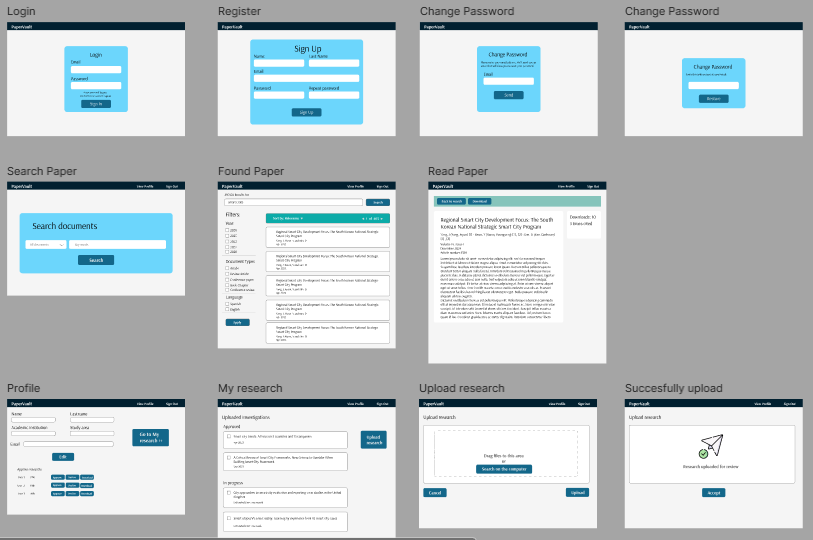
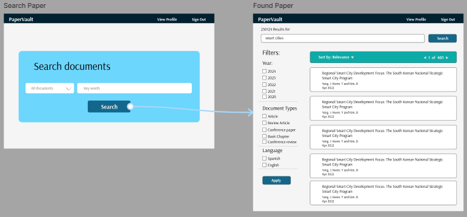
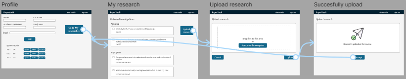
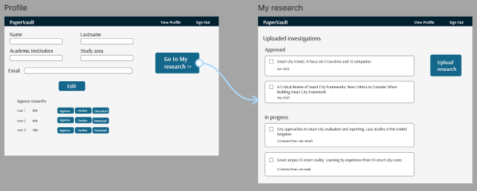
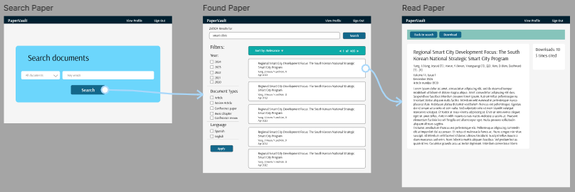

# Style Guidelines
## General Style Guidelines
Una guía de estilo es esencial para PaperVault, ya que proporciona un marco coherente para el equipo de diseño y desarrollo, garantizando una experiencia de usuario consistente y alineada con nuestra misión y visión. Estar conectado a esta guía de estilo permite una implementación más eficiente y coherente de nuestros productos y servicios.

1. **Misión:**

En PaperVault, nuestra misión es impulsar la integridad académica y fomentar un entorno de investigación transparente y colaborativo. Nos dedicamos a combatir la falsificación de autoría, proteger la integridad de los documentos académicos y facilitar el acceso equitativo a la investigación verificada y autenticada.

2. **Visión:**

Aspiramos a ser líderes en la transformación del panorama académico, siendo reconocidos como la plataforma de referencia para la autenticidad y transparencia en la investigación. Buscamos establecer estándares elevados en la verificación de documentos y en la creación de un entorno donde la integridad académica sea primordial.

3. **Público Objetivo:**

Nuestros clientes son principalmente autores de investigaciones científicas y académicas. Asimismo, nos dirigimos a tesistas (estudiantes universitarios) que realizan trabajos de investigación como parte de su formación académica. Es fundamental entender las necesidades y expectativas de este público para diseñar soluciones efectivas y centradas en el usuario. 

4. **Personalidad de la Marca:**

La marca PaperVault se caracteriza por ser confiable, transparente y segura. Nos esforzamos por transmitir estos valores a través de nuestra comunicación visual y diseño intuitivo para con los usuarios. 

5. **Principios de Diseño:**

* **Claridad y Simplicidad:** Priorizamos la claridad y la simplicidad en todos nuestros diseños para garantizar una experiencia intuitiva y sin complicaciones para nuestros usuarios.
* **Transparencia:** Facilitamos el acceso a información clara y veraz sobre nuestros servicios y procesos para promover la confianza y la credibilidad entre nuestros usuarios.
* **Accesibilidad:** Nos comprometemos a diseñar interfaces accesibles que permitan a todos los usuarios, independientemente de sus capacidades, acceder y utilizar nuestros servicios de manera efectiva.
* **Coherencia:** Mantenemos una coherencia visual y de interacción en todas nuestras plataformas y productos para proporcionar una experiencia unificada y reconocible para nuestros usuarios.

 

6. **Elementos de Diseño:**

* **Paleta de Colores:** Utilizamos una paleta de colores que inspire confianza y profesionalismo, con tonos que reflejen la seriedad y la integridad de nuestro compromiso con la calidad académica.
* **Tipografía:** Seleccionamos tipografías legibles y modernas que mejoren la legibilidad de nuestros contenidos y refuercen la imagen de confianza y profesionalismo de la marca.
* **Iconografía:** Empleamos iconos claros y significativos que ayuden a los usuarios a comprender rápidamente las funciones y características de nuestra plataforma, facilitando así su navegación.

 

La guía de estilo de PaperVault no solo establece los principios y elementos fundamentales de diseño, sino que también refleja nuestra dedicación a proporcionar una buena experiencia de usuario que respalde nuestra misión y visión como líderes en la promoción de la integridad académica y la transparencia en la investigación.

## Web, Mobile & Devices Style Guidelines

**Unidad Básica:**

La unidad básica para el diseño en PaperVault es un cuadrado de 8x8 píxeles. Para crear márgenes y relleno, esta unidad se escala en dos, asegurando consistencia y alineación en todos los elementos de la interfaz.

 

**Tipografía:**

Se ha seleccionado la fuente Roboto para garantizar una legibilidad óptima en todos los dispositivos y tamaños de pantalla. Roboto ofrece una combinación perfecta de claridad, modernidad y versatilidad para adaptarse a las necesidades de nuestra audiencia.

 

**Colores Primarios:**

En PaperVault usaremos los siguientes colores: 

1. #012030 - Azul oscuro para encabezados y elementos de alto contraste.
2. #13678A - Azul para destacar acciones principales y enlaces.
3. #0CABA8 - Turquesa para resaltar información importante y llamadas a la acción.
4. #0FC2C0 - Verde azulado para indicadores de éxito y confirmación.
5. #DAFDBA - Amarillo pálido para realzar mensajes informativos y destacados.
6. #6CD6FC - Azul claro para elementos secundarios y de navegación.
7. #86C4BB - Verde azulado suave para fondos y áreas de contenido.
8. #FFFFFF - Blanco para texto sobre fondos oscuros y áreas de enfoque.
9. #000000 - Negro para texto sobre fondos claros y áreas de contraste.

 

**Tonos de Grises:**

Los tonos de grises se utilizan para crear los mockups y proporcionar profundidad y diferenciación en la interfaz, sin distraer la atención del contenido principal:

* #606160
* #727476
* #9C9EA0
* #DEE0E2
* #EDEFF0

 

# Information Architecture
## Labeling Systems

A continuación, se mostrará el sistema de etiquetado que permitirá a nuestros visitantes recibir la información que nuestra Web Application ofrece a tráves de una sola palabra

En el caso de los tesistas contamos con 4 "headings" ubicadas en el menú principal:

* **Inicio**: Sección seleccionada por defecto dónde los tesistas verán infomación relevante que captará su atención y mostrará las opciones principales dirigidas al tesistas.
* **Buscar**: Sección en donde se visualizarán todos los articulos segun lo ingresado por el tesista, además de los filtros que seleccione.
* **Mis Articulos**: Sección enfocada en listar y detallar los articulos seleccionados por el usuario.
* **Mi perfil**: Sección dónde se encuentran los datos personales del tesista.

En el caso de los investigadores contamos con 4 "headings ubicados en el menú principal:

* **Inicio**: Sección seleccionada por defecto dónde los investigadores verán infomación relevante que captará su atención y mostrará las opciones principales dirigidas al investigadores.
* **Mis Investigaciones**: Sección enfocada en listar y detallar los articulos seleccionados por el usuario.
* **Colaboraciones**: Sección en donde se visualizarán los articulos que el investigador ha colaborado.
* **Mi perfil**: Sección dónde se encuentran los datos personales del investigador.

## Searching Systems

A continuación, se mostrará los sistemas de búsqueda que permitirán a nuestros visitantes encontrar la información que nuestra Web Application ofrece.

**Segmento Tesistas**

* **Búsqueda por Título**: Los tesistas podrán buscar investigaciones académicas por título, lo que les permitirá encontrar rápidamente los documentos que necesitan para sus trabajos de investigación.

* **Búsqueda por Autor**: Los tesistas también podrán buscar investigaciones por autor, lo que les permitirá identificar y acceder a trabajos específicos de investigadores reconocidos en su campo de estudio.

* **Búsqueda por Palabras Clave**: La búsqueda por palabras clave permitirá a los tesistas encontrar investigaciones relevantes en función de los temas o conceptos específicos que estén investigando.

* **Filtros de Búsqueda Avanzada**: Se proporcionarán filtros de búsqueda avanzada que permitirán a los tesistas refinar sus resultados en función de criterios específicos, como fecha de publicación, tipo de investigación, área temática, etc.

**Segmento Investigadores**

* **Comentarios**: Los investigadores podrán visualizar los comentarios realizados en cada una de sus investigaciones subidas a la aplicación.

* **Búsqueda de las investigaciones**: Los investigadores podrán buscar las investigaciones que han subido a la aplicación.

## SEO Tags and Meta Tags

**Sitio Web Estático (Landing Page)**

* **Title:** "PaperVault - Tu Repositorio de Investigación Académica"
* **Meta Description**: "PaperVault es una plataforma que ofrece acceso a investigaciones académicas verificadas y autenticadas. Encuentra, lee y colabora en investigaciones de alta calidad en cualquier campo académico."
* **Keywords**: "Repositorio de investigación, Acceso a investigaciones, Plataforma académica, Investigación verificada, Colaboración académica"
* **Author**: "Equipo de PaperVault"
  
**Aplicación Web**

* **Title**: "PaperVault - Tu Repositorio de Investigación Académica"
* **Meta Description**: "PaperVault es una plataforma web que te permite acceder y colaborar en investigaciones académicas verificadas y autenticadas. Encuentra y lee investigaciones de alta calidad en cualquier campo académico."
* **Keywords**: "Repositorio de investigación, Acceso a investigaciones, Plataforma académica, Investigación verificada, Colaboración académica"
* **Author**: "Equipo de PaperVault"

## Navigation Systems

1. **Menús intuitivos y claros**: Se diseñarán menús de navegación simples y bien estructurados que permitan a los usuarios acceder fácilmente a las diferentes secciones del sitio web o la aplicación. Esto puede incluir categorías como "Inicio", "Buscar", "Mis Investigaciones", "Colaboraciones", etc.
2. **Botones de llamada a la acción (CTA)**: Habrán botones de CTA estratégicamente en el Landing Page y en las páginas de la aplicación para dirigir a los usuarios hacia acciones específicas, como "Registrarse", "Iniciar Sesión", "Buscar Investigaciones", "Publicar Investigación", etc.
3. **Barra de búsqueda prominente**: Destacará una barra de búsqueda visible y fácil de usar que permita a los usuarios buscar investigaciones por título, autor, palabras clave, etc.
4. **Rutas de navegación claramente definidas**: Se proporcionarán rutas de navegación claras y lógicas que guíen a los usuarios a través del proceso de búsqueda, lectura y colaboración en investigaciones. Esto puede incluir pasos específicos, como buscar una investigación, leerla, dejar comentarios y compartir con otros usuarios.
5. **Indicadores de progreso**: Para procesos largos o complejos, como el registro de una nueva investigación, habrán indicadores de progreso visuales que muestren a los usuarios en qué etapa del proceso se encuentran y cuánto falta para completarlo.

# Landing Page UI Design
## Landing Page Wireframe

Link figma: https://www.figma.com/file/zNPrqfJSAqfuPlOdPKYcnK/Landing-Page---PaperVault?type=design&node-id=0%3A1&mode=design&t=HEXAmxc46zu9d3Sq-1

## Landing Page Mock-up

Link figma: https://www.figma.com/file/zNPrqfJSAqfuPlOdPKYcnK/Landing-Page---PaperVault?type=design&node-id=9%3A129&mode=design&t=HEXAmxc46zu9d3Sq-1

# Applications UX/UI Design
## Applications Wireframes

### Web

Los wireframes para la versión web realizados son los siguientes:

Link figma: https://www.figma.com/file/Vm0pccqYgyLcYtaHlbmyCb/PaperVault-Wireframes?type=design&node-id=0%3A1&mode=design&t=4bvVK7eQomvPfNaK-1

### Web

Los wireframes para la versión mobile realizados son los siguientes:

Link figma: https://www.figma.com/file/Vm0pccqYgyLcYtaHlbmyCb/PaperVault-Wireframes?type=design&node-id=0%3A1&mode=design&t=4bvVK7eQomvPfNaK-1

## Applications Wireflow Diagrams

Los diagramas que hemos detectado son los siguientes:

Inicio de sesión

Registro de usuario

Buscar paper

Ver perfil

Subir Investigación

Link figma: https://www.figma.com/file/Vm0pccqYgyLcYtaHlbmyCb/PaperVault-Wireframes?type=design&node-id=1%3A2&mode=design&t=4bvVK7eQomvPfNaK-1

## Applications Mock-ups

### Web

Los mockups diseñados para la plataforma web son los siguientes.

Link figma: https://www.figma.com/design/Vm0pccqYgyLcYtaHlbmyCb/PaperVault-Wireframes?node-id=89-2&t=5SP10YNu9MGuVHqX-1

### Mobile

Los mockups diseñados para la plataforma mobile son los siguientes.

## Applications User Flow Diagrams

User Goal: Como tesista, quiero buscar y acceder a papers relevantes para realizar mi investigación de manera eficiente.

User Goal: Como autor, quiero subir mis investigaciones a la plataforma para poder mostrar mi trabajo. 

User Goal: Como autor quiero ver mis investigaciones en curso para llevar un registro del progreso de las investigaciones en revisión.

User Goal: Como tesista quiero descargar un paper de mi interés para poder leerlo estando sin conexión.

# Applications Prototyping

### Web

Link: https://drive.google.com/file/d/1G8TrTdDMzdaAFt92k3vQZMo2_lzsILqI/view?usp=sharing

### Mobile

Link: https://drive.google.com/file/d/1wgMb-sgji-cue_H3moMvJBBpFm7Cs9Gb/view?usp=sharing