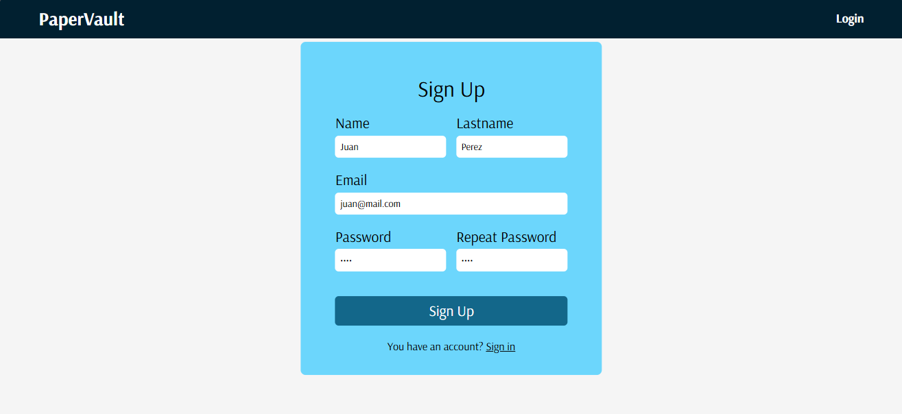
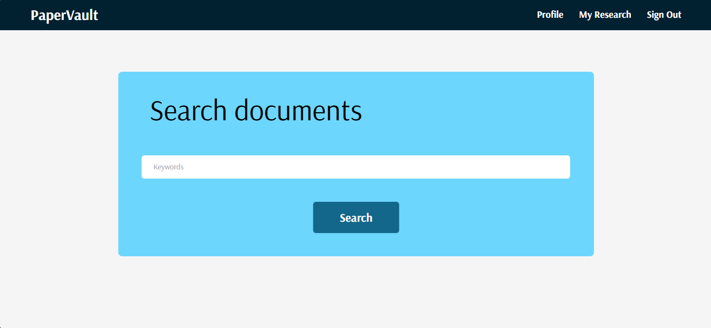
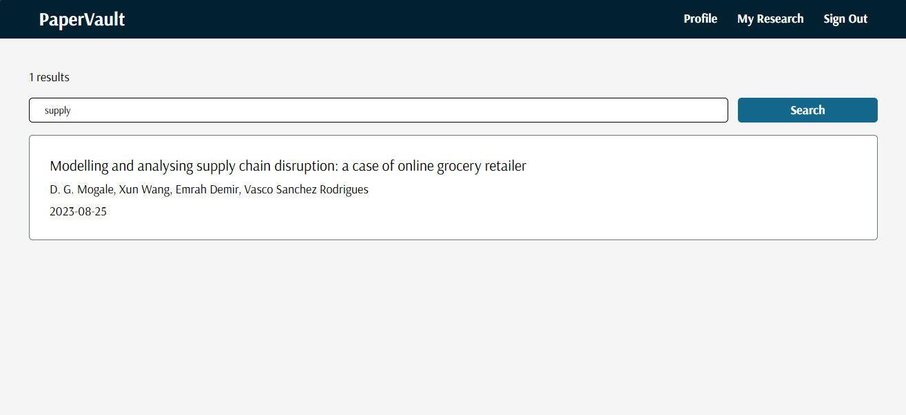
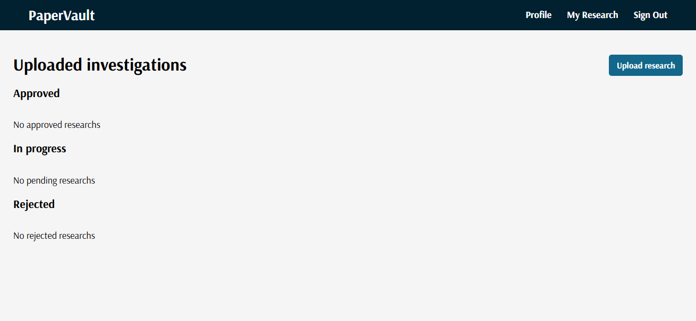
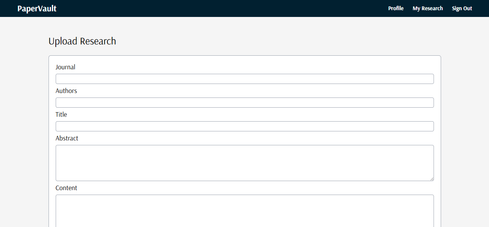
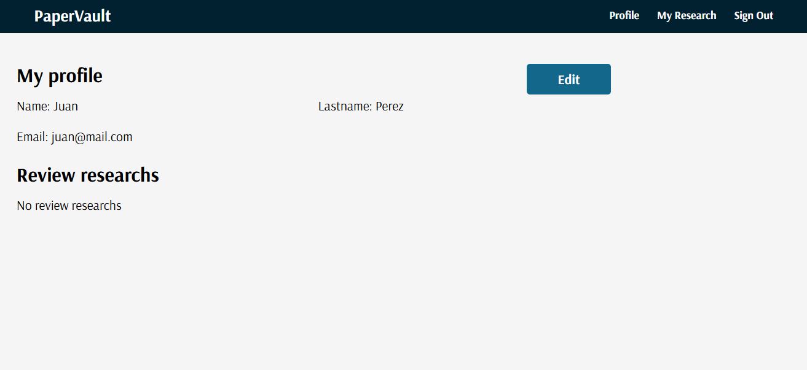
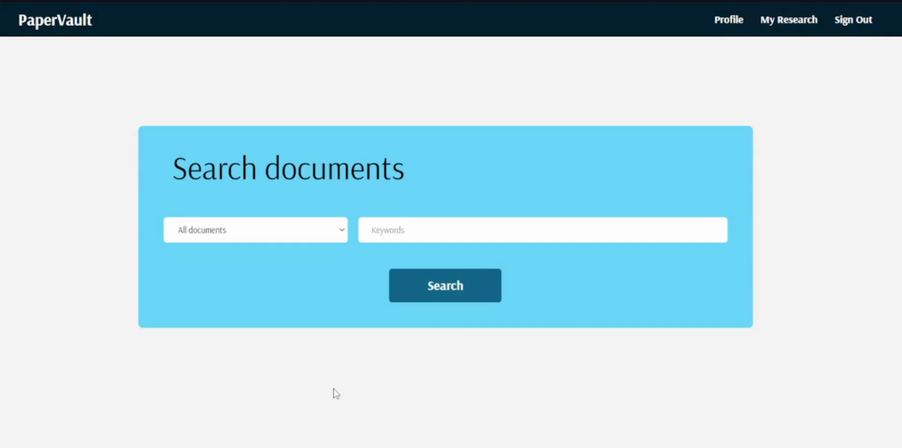
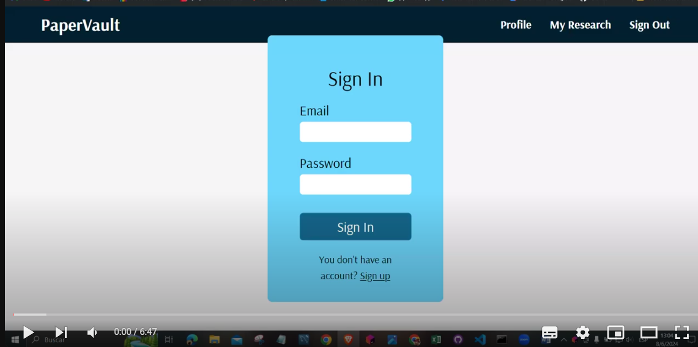

# Software Configuration Management

## Software Development Environment Configuration

Para el desarrollo de la aplicación, se usaron las siguientes herramientas:

- **Angular**: Un framework opensource manetenido por Google que utiliza typescript para el desarrollo de aplicaciones de una sola página (SPA) y aplicaciones web dinámicas. Además, ofrece una arquitectura de componentes, lo que permite realizar interfaces más complejas.

- **Springboot**: Un framework de desarrollo web badado en Java. Para el proyecto, se va a utilizar para el desarrollo de un API que va a permitir brindar los datos al front-end, manejar la lógica de negocio y guardar los datos en la blockchain.

- **Ganache**: Es una herramienta que brinda una blockchain personal para desarrollar aplicaciones descentralizadas en un entorno controlado y seguro.

- **Truffle**: Es un framework que permite el desarrollo de contratos inteligentes y aplicaciones descentralizadas en el ecosistema Ethereum

## Source Code Management

Utilizaremos GitHub como Plataforma y sistema de control de versiones de nuestro proyecto. 

Bajo el modelo de creación de ramas Gitflow es que se crearon los repositorios para el Back-end y Front-end, donde se crearon las siguientes ramas para el desarrollo del proyecto:

**Main**: En esta rama se encuentra la versión completa, que ha pasado pruebas y no hay problemas en su ejecución. Por lo tanto, es la que se va a desplegar y mostrar a los usuarios.

**Hotfix**: En caso hubiera un problema con la versión del proyecto en la rama Main, se usará esta rama como respaldo para encontrar y solucionar el problema lo más rápido posible

**Release**: En esta rama la aplicación web se ejecuta sin problema, pero debe pasar por pruebas para validar todas las funcionalidades. Cuando se realicen las pruebas y no haya errores esta versión pasa a la rama Main.

**Develop**: Esta rama sigue en desarrollo, solucionar distintos problemas o requerimientos aún en desarrollo. Cuando esta rama se encuentre terminada para un sprint, entonces pasa a la Rama Release

## Source Code Style Guide & Conventions

### Java y Spring Boot

- **Nombres de clases y paquetes**: Se utilizará camelCase con mayúscula inicial. Por ejemplo, `UserService`.
- **Nombres de métodos y variables**: Se utilizará camelCase sin mayúscula inicial. Por ejemplo, `getUserById()` o `firstName`.
- **Espacios en blanco y sangría**: Se utilizará 1 tabulador para la sangría
- **Comentarios**: Se utilizarán comentarios Javadoc para documentar clases, métodos y variables.
- **Importaciones**: Se utilizarán declaraciones import static para importar clases estáticas.
- **Manejo de excepciones**: Se utilizará try-catch para manejar excepciones.
- **Anotaciónes**: Se utilizarán anotaciones Spring para configurar beans y componentes.

### Flutter

* **Nombres de clases y widgets:** Se utilizará camelCase con mayúscula inicial. Por ejemplo, `MyWidget` o `MyHomePage`.
* **Nombres de métodos y variables:** Se utilizará camelCase sin mayúscula inicial. Por ejemplo, `buildWidget()` o `firstName`.
* **Espacios en blanco y sangría:** Se utilizará 1 tabulador para la sangría.
* **Comentarios:** Se utilizarán comentarios de línea y comentarios de bloque para documentar código.
* **Importaciones:** Se utilizarán declaraciones import para importar librerías y clases.
* **Manejo de estado:** Se utilizará `setState()` para actualizar el estado del widget.
* **Desarrollo asincrónico:** Se utilizará `async/await` para manejar operaciones asincrónicas.

### Angular:

* **Nombres de componentes, directivas y servicios:** Se utilizará camelCase con prefijo app. Por ejemplo, `AppComponent` o `appMyService`.
* **Nombres de propiedades y métodos:** Use camelCase sin prefijo. Por ejemplo, `firstName` o `getUserById()`.
* **Espacios en blanco y sangría:** Se utilizará 1 tabulador para la sangría.
* **Comentarios:** Use comentarios de línea y comentarios de bloque para documentar código.
* **Importaciones:** Se utilizarán declaraciones `import` para importar módulos y componentes.
* **Enrutamiento:** Se utilizará el enrutador de Angular para navegar entre componentes.
* **Manejo de datos:** Se utilizará `HttpClient` para realizar peticiones HTTP.

### PostgreSQL:

* **Nombres de tablas y columnas:** Se utilizarán minúsculas y guiones bajos para separar palabras. Por ejemplo, `user_table` o `first_name`.
* **Nombres de índices y restricciones:** Se utilizarán minúsculas y guiones bajos para separar palabras. Por ejemplo, `idx_user_id` o `fk_user_table`.
* **Tipos de datos:** Se utilizarán los tipos de datos de PostgreSQL adecuados para sus datos. Por ejemplo, `VARCHAR(255)` para almacenar cadenas de texto de hasta 255 caracteres.
* **Consultas SQL:** Se utilizarán consultas SQL claras y concisas. Evite consultas complejas y difíciles de entender.
* **Optimización de rendimiento:** Se utilizarán índices y consultas optimizadas para mejorar el rendimiento de la base de datos.

## Software Deployment Configuration

En esta sección, el equipo especifica la configuración del despliegue de la solución, incluyendo los pasos necesarios para que, a partir de los repositorios de código fuente, se pueda lograr el despliegue o publicación satisfactorio de cada uno de los productos digitales en la solución.

### Requisitos previos

**Repositorios de código fuente**

* Backend (Java y Spring Boot): Repositorio en GitHub (https://github.com/orgs/ARQUI-SOFTWARE-EMERGENTES/repositories).
* Frontend (Flutter y Angular): Repositorios separados en GitHub (https://github.com/orgs/ARQUI-SOFTWARE-EMERGENTES/repositories).
* Base de datos: PostgreSQL.

**Entorno de desarrollo**

* Java Development Kit (JDK).
* Node.js y npm.
* Flutter SDK.
* PostgreSQL.

### Pasos de despliegue

1. Configuración de PostgreSQL en AWS RDS
    - Crear una instancia de PostgreSQL en Amazon RDS. 
    - Configurar las credenciales y parámetros de conexión (host, puerto, usuario, contraseña, base de datos).,

2. Configuración de instancias EC2 
   - Crear una instancia de EC2 para el backend. 
   - Instalar JDK y configurar variables de entorno. 
   - Instalar PostgreSQL client tools para pruebas de conectividad.

3. Despliegue del Backend (Spring Boot)
   - Compilación del proyecto 
   - Clonar el repositorio del backend. 
   - Ejecutar ./mvnw clean package para compilar el proyecto y generar el archivo .jar.
 
4. Configuración del entorno

   - Establecer variables de entorno necesarias (e.g., DB_HOST, DB_PORT, DB_USER, DB_PASSWORD).
   
5. Despliegue en EC2
   - Transferir el archivo .jar a la instancia de EC2.
   - Ejecutar java -jar nombre-del-archivo.jar.

# Solution Implementation

## Sprint 1

### Sprint Planning 1

<table>
   <thead>
      <tr>
         <th> Sprint # </th>
         <th> Sprint 1 </th>
      </tr>
   </thead>
   <tbody>
   <tr>
      <td> Date </td>
      <td> 02-06-2024 </td>    
   </tr>

   <tr>
      <td> Time </td>
      <td> 06:00 PM </td>
   </tr>

   <tr>
      <td> Location </td>
      <td> Reunión por Meet </td>
   </tr>

   <tr>
      <td> Prepared By </td>
      <td> Gonzalo Barrazueta </td>
   </tr>

   <tr>
      <td> Attendees </td>
      <td> Jonatan Curi / Gonzalo Barrazueta / Vivian Pongo / Gonzalo Sakuda / Jackeline Salomé </td>
   </tr>

   <tr>
      <td> Sprint n Review Summary </td>
      <td> En esta entrega no hay un Sprint anterior, por lo tanto, no hay resúmen del Sprint anterior   </td>
   </tr>

   <tr>
      <td> Sprint n Retrospective Summary </td>
      <td> En esta entrega no hay un Sprint anterior, por lo tanto, no hay resúmen del Sprint anterior   </td>
   </tr>

   <tr>
      <th colspan="2"> Sprint Goal </th>
   </tr>

   <tr>
      <td> Sprint 1 Goal </td>
      <td> La meta de este Sprint es el desarrollo de la primera versión de la aplicación web, frontend y backend </td>
   </tr>

   <tr>
      <td> Sprint 1 Velocity </td>
      <td> X Velocity </td>
   </tr>

   <tr>
      <td> Sum of Story Points </td>
      <td> X Story Points </td>
   </tr>
      
</table>

### Sprint Backlog 1

<table>
   <thead>
      <tr>
         <th colspan="1"> Sprint # </th>
         <th colspan="7"> Sprint 1 </th>
      </tr>
      <tr>
         <th colspan="2"> User Story </th>
         <th colspan="6"> Work-Item / Task </th>
      </tr>
      <tr>
         <th> Id </th>
         <th> Title </th>
         <th> Id </th>
         <th> Title </th>
         <th> Description </th>
         <th> Estimation (Hours) </th>
         <th> Assigned To </th>
         <th> Status (To-do / Doing / Done) </th>
      </tr>
   </thead>
      <tbody>
      <tr>
         <td> US01 </td>
         <td> Registrar cuenta </td>
         <td> T1 </td>
         <td> Crear formulario de registro </td>
         <td> Diseñar e implementar el formulario de registro para nuevos usuarios </td>
         <td> 5 </td>
         <td> Gonzalo Sakuda </td>
         <td> Hecho </td>
      </tr>
      <tr>
         <td> US02 </td>
         <td> Iniciar Sesión </td>
         <td> T2 </td>
         <td> Implementar inicio de sesión </td>
         <td> Desarrollar la funcionalidad de inicio de sesión con autenticación </td>
         <td> 4 </td>
         <td> Fernanda Salomé </td>
         <td> Hecho </td>
      </tr>
      <tr>
         <td> US03 </td>
         <td> Cambiar contraseña </td>
         <td> T3 </td>
         <td> Restablecer contraseña </td>
         <td> Implementar la funcionalidad para permitir a los usuarios cambiar su contraseña </td>
         <td> 6 </td>
         <td> Gonzalo Sakuda </td>
         <td> En progreso </td>
      </tr>
      <tr>
         <td> US08 </td>
         <td> Filtrar resultados por fecha </td>
         <td> T4 </td>
         <td> Filtro por fecha </td>
         <td> Añadir funcionalidad de filtro para ordenar los resultados por fecha </td>
         <td> 3 </td>
         <td> Fernanda Salomé </td>
         <td> Hecho </td>
      </tr>
      <tr>
         <td> US09 </td>
         <td> Filtrar resultados por tipo </td>
         <td> T5 </td>
         <td> Filtro por tipo </td>
         <td> Implementar filtro de resultados basado en el tipo </td>
         <td> 3 </td>
         <td> Gonzalo Sakuda </td>
         <td> Hecho </td>
      </tr>
      <tr>
         <td> US10 </td>
         <td> Filtrar resultados por idioma </td>
         <td> T6 </td>
         <td> Filtro por idioma </td>
         <td> Añadir filtro de idioma a los resultados </td>
         <td> 3 </td>
         <td> Fernanda Salomé </td>
         <td> Hecho </td>
      </tr>
      <tr>
         <td> US11 </td>
         <td> Ordenar resultados por relevancia </td>
         <td> T7 </td>
         <td> Ordenar por relevancia </td>
         <td> Implementar la ordenación de resultados por relevancia </td>
         <td> 4 </td>
         <td> Gonzalo Sakuda </td>
         <td> Hecho </td>
      </tr>
      <tr>
         <td> US12 </td>
         <td> Leer paper completo </td>
         <td> T8 </td>
         <td> Vista completa del paper </td>
         <td> Desarrollar la funcionalidad para ver el paper completo </td>
         <td> 5 </td>
         <td> Fernanda Salomé </td>
         <td> Hecho </td>
      </tr>
      <tr>
         <td> US13 </td>
         <td> Guardado de papers </td>
         <td> T9 </td>
         <td> Guardar papers </td>
         <td> Implementar la funcionalidad de guardado de papers </td>
         <td> 6 </td>
         <td> Gonzalo Sakuda </td>
         <td> En progreso </td>
      </tr>
      <tr>
         <td> US14 </td>
         <td> Subir investigación </td>
         <td> T10 </td>
         <td> Subir investigación </td>
         <td> Desarrollar la funcionalidad para subir papers de investigación </td>
         <td> 7 </td>
         <td> Fernanda Salomé </td>
         <td> Hecho </td>
      </tr>
      <tr>
         <td> US21 </td>
         <td> Gestionar perfil </td>
         <td> T11 </td>
         <td> Gestionar perfil </td>
         <td> Implementar las características de gestión de perfil </td>
         <td> 5 </td>
         <td> Gonzalo Sakuda </td>
         <td> Hecho </td>
      </tr>
   </tbody>
</table>

### Development Evidence for Sprint Review

| **Repository** | **Branch** |  **Commit Id**  | **Commit Message** | **Commited on (Date)** |
|-----------|-----------|-----------|-----------|-----------|
| Final Project    | realease/tb2    | 90b8ec755d4f995e602947d427ded8ee59adb086    | feat(docs): new chapter and sprint planning 1 added    | 04/06/2024    | 
| Final Project    | realease/tb2    | 2b3badfd78a7e5ffcc9716ab57d5857da7c6ec61    | feat(docs): describe Source Code Style Guide & Conventions    | 04/06/2024    |
| Final Project    | realease/tb2    | bd01f526f63bdf87bf3a5d0ccbf5e9270e3083fe    | feat(docs): describe Software Deployment Configuration    | 05/06/2024    | 
| Final Project    | realease/tb2    | 416f09fa0e4beeb617f8da54959f8b6f5b4026db    | feat(docs): describe Software Deployment Evidence for Sprint Review    | 05/06/2024    | 
| Final Project    | realease/tb2    | c7eb07e3928e591716c53f21235fd4416817601d    | feat(docs): add version history    | 05/06/2024    | 
| Final Project    | realease/tb2    | 37d0aa530d05902b496e89fd86365a14c9e1554a    | feat(docs): add mockups and prototipe    | 05/06/2024    | 
| Final Project    | realease/tb2    | a38ce7f8b5ba0c8043d4cdd1125a18b6e7144fdf    | feat(docs): add student outcome tb2    | 05/06/2024    |
| Final Project    | realease/tb2    | 791313d78074750cd3d1766f55d4119e2a2b9337    | feat: validation interview added    | 07/06/2024    |
| Final Project    | realease/tb2    | 5c70bf9ce34521d4b1831ca274405592daeea84c    | feat: video about-the-product added    | 07/06/2024    |
| api_user    | main    | b73d8dfb092cb79ad2117a86d724b4a97228b093   | feat: first commit   | 03/06/2024   |
| papervault-app    | realease/tb2    | 41fdee1f97e142d60662fc25519d78e41dab8d27   | feat: add my-research design
   | 01/06/2024   |
| research-service    | main    | ed6b138aab78585ba17dced884c02015ed23b729   | feat: first commit   | 03/06/2024   |

### Testing Suite Evidence for Sprint Review

| Repository                        | Branch      | Commit Id                             | Commit Message         | Commited on (Date) |
|-----------------------------------|-------------|---------------------------------------|------------------------|--------------------|
| api_user          | release/tb2 | 09966d72b5b4433b5963ce21993b708528ccf512 | unit test register | 01/06/2024   |
| api_user           | release/tb2 | 6be83b898b88712a83ecbbd099e43ba5264b9403 | add:integration test    | 01/06/2024  |
| research-service                 | release/tb2 | 462c4f9a3f86169315a60fe257f91c3b9ce10f92 | feat: add base test     | 01/06/2024 |
| research-service            | release/tb2 | 5821a092012279aae8d28de965b8d90799893bce | feat: added new test    | 01/06/2024|
| dicovery-service        | release/tb2 | efc9186e426700d78424b6303e73356cc17bdd18 | feat: added two tests.  | 01/06/2024 |

### Execution Evidence for Sprint Review

Sección Back-End

**Alcance:**

En el área de desarrollo back-end, se han creado los bounded contexts de “Envio de Investigaciones”, “Asignación de Investigaciones”, “Plazo de Revisión” y “Comentarios”. Estos bounded contexts están integrados a una API que proporciona todos los servicios necesarios para cada uno. La documentación de estos servicios se realizará utilizando Swagger, lo que permitirá una vista previa de los métodos aplicados en cada contexto.

### Services Documentation Evidence for Sprint Review

<h3>Bounded Context : ProfileManagement</h3>
Entidad : Usuario

| Endpoint | Acciones realizadas                            | Ruta del Endpoint                     | Parámetros                                                                           |
| -------- | ---------------------------------------------- | ------------------------------------- | ------------------------------------------------------------------------------------ |
| POST     | Crea un usuario, a partir de un id del usuario | /api/users/user/register              | userId, nombre, apellidos, email, teléfono, dirección, fechaNacimiento, genero       |
| GET      | Muestra un usuario según su id                 | /api/users/user/{userId}              | userId                                                                               |
| DELETE   | Elimina un usuario por su id                   | /api/users/user/delete/{userId}       | userId                                                                               |
| PUT      | Edita la información del usuario               | /api/users/user/edit/{userId}         | userId y los campos a editar del usuario                                             |

<h3>Bounded Context : ProfileManagement</h3>
Entidad : Research

| Endpoint | Acciones realizadas                            | Ruta del Endpoint                        | Parámetros                                               |
| -------- | ---------------------------------------------- | ---------------------------------------- | -------------------------------------------------------- |
| POST     | Crea una investigación, a partir de un id del usuario | /api/research/register                   | userId, title, description, startDate, endDate, status   |
| GET      | Muestra una investigación según su id          | /api/research/{researchId}               | researchId                                               |
| DELETE   | Elimina una investigación por su id            | /api/research/delete/{researchId}        | researchId                                               |
| PUT      | Edita la información de la investigación       | /api/research/edit/{researchId}          | researchId y los campos a editar de la investigación     |

### Software Deployment Evidence for Sprint Review

**Introducción**

Durante este Sprint, el equipo se centró en establecer y configurar la infraestructura de despliegue necesaria para nuestro proyecto. Esto incluyó la creación de cuentas en proveedores de la nube, la configuración de recursos necesarios y la integración de procesos de despliegue para asegurar flujos de trabajo fluidos y automatizados. El objetivo fue crear un pipeline de despliegue robusto que pudiera manejar todos los productos digitales, incluyendo el backend (Java y Spring Boot), el frontend (Flutter y Angular) y la base de datos PostgreSQL.

**Actividades Realizadas**

1. Creación de Cuentas en Proveedores de la Nube
   
   - Se creó y configuró una cuenta de AWS para gestionar los recursos en la nube. 
   - Se configuraron roles y permisos de usuario utilizando AWS Identity and Access Management (IAM) para asegurar el acceso seguro a los recursos.

2. Configuración de Recursos en la Nube

   * Se creó una instancia de Amazon RDS para PostgreSQL.
   * Se configuró la instancia de la base de datos con los grupos de seguridad y los parámetros adecuados.
   * Se establecieron configuraciones de conectividad para asegurar un acceso seguro y fiable a la base de datos.
   * Se lanzaron instancias de EC2 para los servicios del backend. 
   * Se instaló el software necesario (JDK, herramientas de cliente de PostgreSQL) en las instancias de EC2. 
   * Se configuraron grupos de seguridad para gestionar el tráfico entrante y saliente de las instancias.

3. Configuración de Proyectos de Desarrollo

   * Se clonó el repositorio del backend y se configuró el proyecto para conectarse a la nueva instancia de PostgreSQL.
   * Se actualizaron las propiedades de la aplicación con las credenciales necesarias y los detalles de conexión a la base de datos.
   * Se empaquetó la aplicación utilizando Maven y se preparó para el despliegue.

### Team Collaboration Insights during Sprint

A continuación se muestra la colaboración de los miembros del equipo en el desarrollo del proyecto:

## Sprint 2

### Sprint Planning 2

<table>
   <thead>
      <tr>
         <th> Sprint # </th>
         <th> Sprint 2 </th>
      </tr>
   </thead>
   <tbody>
   <tr>
      <td> Date </td>
      <td> 22-06-2024 </td>    
   </tr>

   <tr>
      <td> Time </td>
      <td> 06:00 PM </td>
   </tr>

   <tr>
      <td> Location </td>
      <td> Reunión por Meet </td>
   </tr>

   <tr>
      <td> Prepared By </td>
      <td> Gonzalo Barrazueta </td>
   </tr>

   <tr>
      <td> Attendees </td>
      <td> Jonatan Curi / Gonzalo Barrazueta / Vivian Pongo / Gonzalo Sakuda / Jackeline Salomé </td>
   </tr>

   <tr>
      <td> Sprint 1 Review Summary </td>
      <td> En el sprint anterior nos enfocamos en la realización de la primera versión de la aplicación web. Asimismo, se desarrolló la primera versión del backend de la aplicación </td>
   </tr>

   <tr>
      <td> Sprint 1 Retrospective Summary </td>
      <td> En el sprint anterior se implementaron las vistas necesarias para la visualización de investigaciones y la función de agregar investigaciones </td>
   </tr>

   <tr>
      <th colspan="2"> Sprint Goal </th>
   </tr>

   <tr>
      <td> Sprint 2 Goal </td>
      <td> La meta de este Sprint es el desarrollo de total de la aplicación web, frontend y backend añadiendo tambien la tecnología blockchain </td>
   </tr>

   <tr>
      <td> Sprint 2 Velocity </td>
      <td> X Velocity </td>
   </tr>

   <tr>
      <td> Sum of Story Points </td>
      <td> X Story Points </td>
   </tr>
      
</table>

### Sprint Backlog 2

### Development Evidence for Sprint Review

### Testing Suite Evidence for Sprint Review

### Execution Evidence for Sprint Review

*Registro de usuario*

*Inicio de sesión*

*Buscar paper*

*Papers encontrados*

*Mis investigaciones*

*Subir investigacion*

*Perfil de usuario*

### Services Documentation Evidence for Sprint Review

### Software Deployment Evidence for Sprint Review

### Team Collaboration Insights during Sprint

# Validation Interviews

## Diseño de entrevistas

1. ¿Cómo descrbirías tu experiencia general con la interfaz de usuario?
2. ¿Encontraste la aplicaicón fácil de navegar o hubo algo que te resultó confuso?
3. ¿Qué opinas de las funciones disponibles para subir y visualizar los artículos?
5. ¿Qué opinas sobre el proceso de validación por otros investigadores?
6. ¿Crees que esta aplicación será útil para tu trabajo de investigación o tesis?
7. ¿Qué tan seguro te sientes respecto a la fiabilidad de los documentos en la plataforma?
8. ¿Hay alguna característica adicional que te gustaría ver en la aplicación?
9. ¿Tienes alguna sugerencia para mejorar la alguna funcionalidad actual?
10. ¿Recomendarías esta aplicación a otros tesistas o investigadores? ¿Por qué?

## Registro de entrevistas

### Entrevista 1:

* **Nombre**: Paulo Costa Mondragón
* **Link**: https://www.youtube.com/watch?v=yTkus_3xJaA
* **Duración**: 7:15
* **Captura**:

  
 

* **Resumen**: Paulo nos cuenta que le gustaría una funcionalidad diferencial a otras journals o bases de datos. Asimismo, destaca la importancia de la validación de los papers y la facilidad de uso de la plataforma. Además, sugiere la posibilidad de agregar un sistema de validación de papers y de investigadores más seguro.

### Entrevista 2:

* **Nombre**: Jorge Diaz Chanchari
* **Link**: https://youtu.be/r1ikRECviTs
* **Duración**: 6:47
* **Captura**:

  
 

* **Resumen**: El usuario, Jorge, encuentra la interfaz intuitiva, minimalista y amigable, lo que facilita la gestión eficiente de documentos de investigación. Sin embargo, sugiere mejorar la funcionalidad de búsqueda con opciones de filtrado avanzado y mejorar el rendimiento de la aplicación para manejar grandes volúmenes de usuarios. La aplicación es recomendada por él por su fiabilidad, capacidad de organización y una interfaz agradable.

## Evaluaciones según heurísticas

# Video About-the-Product

* **Link**: https://www.youtube.com/watch?v=13vUkeYQZns
* **Duración**: 3:00
* **Captura**:

 

* **Resumen**: En el video se presenta las funcionalidades implementadas de momento en la aplicación, como el registro de usuarios, la visualización de papers, la búsqueda y filtrado de papers, y la gestión de perfil. Se destaca la facilidad de uso y la interfaz intuitiva de la aplicación, así como la importancia de la validación de los papers y la seguridad de la plataforma.
