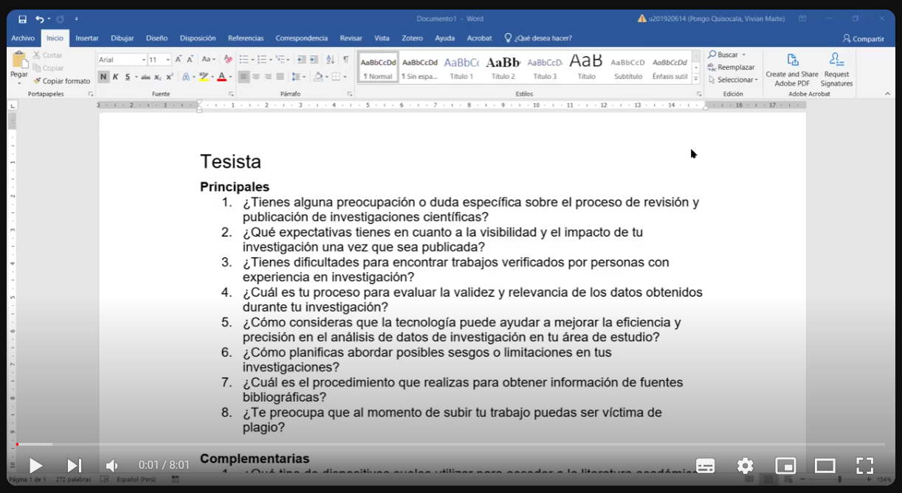
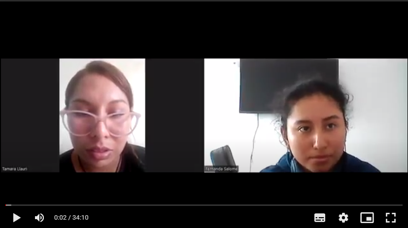
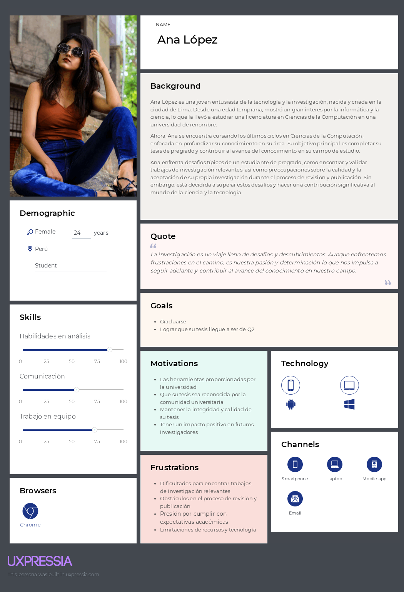
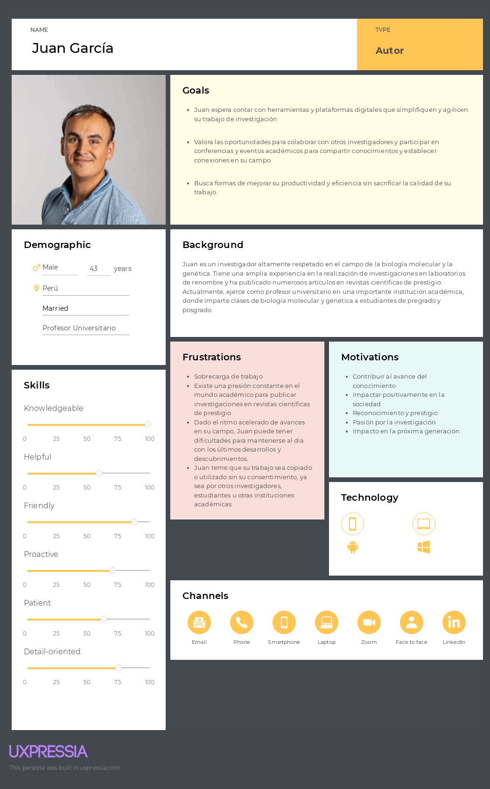

# Competidores

## Análisis competitivo

<table>
    <thead>
        <tr>
            <th colspan="6">Competitive Analysis Landscape</th>
        </tr>
    </thead>
    <tbody>
        <tr>
            <td colspan="2" rowspan="2">¿Por qué llevar acabo este análisis?</td>
            <td colspan="5">¿Qué podemos aprender de soluciones similares implementadas previamente?</td>
        </tr>
        <tr>
            <td colspan="5">La comparación de diversas soluciones se lleva a cabo con el propósito de identificar las fortalezas, oportunidades, debilidades y amenazas presentes en nuestros competidores. Este análisis nos permite evaluar áreas de mejora potenciales, con el fin de desarrollar un producto más completo y competitivo.</td>
        </tr>
        <tr>
            <td colspan="2"></td>
            <td><b>PaperVault</b></td>
            <td><b>Google Scholar</b></td>
            <td><b>Web of Science</b></td>
            <td><b>Scopus</b></td>
        </tr>
        <tr>
            <td rowspan="2">Perfil</td>
            <td>Overview</td>
            <td>Es una plataforma que tiene como objetivo mejorar la transparencia, la integridad y la accesibilidad en el proceso de revisión y publicación de investigaciones académicas. Además, ofrece un repositorio centralizado de investigaciones verificadas y autenticadas, facilitando el acceso a recursos de alta calidad.</td>
            <td>Es un motor de búsqueda especializado en literatura académica y científica que ofrece funcionalidades avanzadas de búsqueda y permite a los usuarios realizar un seguimiento de las citas de sus trabajos.</td>
            <td>Es una plataforma de información académica que ofrece herramientas de búsqueda avanzada, análisis de citas y métricas de investigación para ayudar a los investigadores a encontrar y evaluar la literatura académica relevante en sus campos de estudio.</td>
            <td>Es una base de datos bibliográfica que  ofrece herramientas de análisis de citas, métricas de investigación y funciones de seguimiento para ayudar a los investigadores a evaluar la influencia y el impacto de su trabajo.</td>
        </tr>
        <tr>
            <td>Ventaja competitiva ¿Qué valor ofrece a los clientes?</td>
            <td>Los usuarios pueden acceder a investigaciones académicas de alta calidad, verificadas y autenticadas, sin preocuparse por la falta de transparencia o la posibilidad de falsificación.</td>
            <td>Los usuarios pueden encontrar fácilmente información relevante y actualizada sobre temas de interés académico, lo que les permite mantenerse al día con los últimos avances en su campo de estudio.</td>
            <td>Los usuarios pueden evaluar la literatura académica relevante en sus campos de estudio, utilizando herramientas avanzadas para seguir el impacto y la influencia de su trabajo. Además, Web of Science proporciona una plataforma integral para la investigación académica.</td>
            <td>Los investigadores pueden acceder a una amplia gama de recursos académicos y utilizar herramientas avanzadas para evaluar la influencia y el impacto de su trabajo.</td>
        </tr>
        <tr>
            <td rowspan="2">Perfil de Marketing</td>
            <td>Mercado objetivo</td>
            <td>Está dirigido a estudiantes, académicos, investigadores, editores de revistas científicas y organizaciones de investigación que buscan mejorar la transparencia, integridad y accesibilidad en el proceso de revisión y publicación de investigaciones académicas.</td>
            <td>Está dirigido a estudiantes, académicos, investigadores y profesionales de diversas disciplinas que buscan acceder a información académica y científica relevante y actualizada.</td>
            <td>Está dirigido a investigadores, académicos, bibliotecarios, instituciones académicas, editores de revistas científicas y organizaciones de investigación que buscan acceder a una amplia gama de contenido académico y utilizar herramientas avanzadas de análisis de citas y métricas de investigación.</td>
            <td>Está dirigido a investigadores académicos, científicos, bibliotecarios, instituciones académicas y organizaciones de investigación que buscan acceder a una amplia base de datos bibliográfica multidisciplinaria.</td>
        </tr>
        <tr>
            <td>Estrategias de marketing</td>
            <td>PaperVault se promociona a través de una combinación de marketing digital, relaciones públicas y marketing de contenidos. Esto incluye la publicidad en línea dirigida a estudiantes, académicos, investigadores y editores de revistas científicas, así como la participación en conferencias académicas y eventos relacionados con la investigación.</td>
            <td>Google Scholar se beneficia del marketing de motores de búsqueda y la promoción de la marca a través de la reputación de Google. Además, Google promueve Google Scholar a través de sus plataformas existentes, como Google Search y Google Chrome.</td>
            <td>Web of Science se promociona principalmente a través de marketing digital, relaciones públicas y asociaciones con editores de revistas científicas y organizaciones de investigación. Esto incluye la participación en conferencias y eventos académicos para promover su plataforma y establecer relaciones con la comunidad académica. </td>
            <td>Scopus utiliza una combinación de marketing digital, relaciones públicas y marketing de contenidos para promover su plataforma. Esto incluye la promoción en línea a través de redes sociales, publicidad en línea y marketing por correo electrónico dirigido a investigadores académicos y profesionales de la información.</td>
        </tr>
        <tr>
            <td rowspan="3">Perfil de Producto</td>
            <td>Productos & Servicios</td>
            <td>Ofrece un sistema transparente de revisión por pares respaldado por tecnología blockchain, que garantiza la autenticidad y veracidad de las investigaciones publicadas. Además, proporciona un repositorio centralizado de investigaciones.</td>
            <td>Ofrece acceso gratuito a una amplia gama de recursos académicos, incluidos artículos de revistas científicas, tesis, libros y patentes. Además, proporciona funciones avanzadas de búsqueda y seguimiento de citas, </td>
            <td>Ofrece acceso a artículos de revistas científicas, libros, conferencias y patentes. Además, proporciona herramientas avanzadas de análisis de citas y métricas de investigación.</td>
            <td>Ofrece acceso a resúmenes y citas de artículos de revistas académicas, libros, conferencias y patentes. Además, proporciona herramientas de análisis de citas, métricas de investigación y funciones de seguimiento,</td>
        </tr>
        <tr>
            <td>Precios & Costos</td>
            <td>PaperVault se monetiza ofreciendo suscripciones premium que proporcionen acceso a funciones avanzadas, como métricas de impacto y análisis de tendencias. Además, se considera la inclusión de publicidad relevante, la venta de datos analíticos a instituciones académicas y editoriales científicas, establecer alianzas para acceso institucional, y ofrecer licencias de uso de su tecnología blockchain.</td>
            <td>Google Scholar es gratuito para los usuarios finales. No cobra por el acceso a su base de datos de literatura académica y científica ni por el uso de sus funciones de búsqueda y seguimiento de citas.</td>
            <td>Web of Science requiere una suscripción para acceder a su plataforma y contenido. El costo de la suscripción varía según el tipo de usuario y el nivel de acceso.</td>
            <td>Scopus requiere una suscripción para acceder a su base de datos bibliográfica y sus herramientas de análisis. El costo de la suscripción varía según el tipo de usuario (individual, institucional) y el nivel de acceso (básico, premium).</td>
        </tr>
        <tr>
            <td>Canales de distribución (Web y/o Móvil)</td>
            <td>PaperVault distribuye su plataforma a través de su sitio web oficial, donde los usuarios pueden acceder al servicio mediante registro y suscripción. </td>
            <td>Google Scholar utiliza principalmente canales digitales para la distribución de su servicio. Estos incluyen el motor de búsqueda de Google, que es accesible a través de navegadores web y dispositivos móviles.</td>
            <td>Web of Science distribuye su plataforma a través de su sitio web, donde los usuarios pueden acceder al contenido mediante suscripción individual o institucional. </td>
            <td>Google Scholar utiliza principalmente canales digitales para la distribución de su servicio. Estos incluyen el motor de búsqueda de Google, que es accesible a través de navegadores web y dispositivos móviles.</td>
        </tr>
        <tr>
            <td rowspan="4">Análisis SWOT</td>
            <td>Debilidades</td>
            <td>La adopción de PaperVault por parte de la comunidad académica puede llevar tiempo y requerir esfuerzos significativos de marketing y promoción. Además, la implementación y mantenimiento de la tecnología blockchain utilizada es costosa.</td>
            <td>La relevancia de los resultados puede variar según el algoritmo de búsqueda utilizado por Google Scholar, lo que puede afectar la precisión de los resultados.</td>
            <td>La interfaz de usuario de Web of Science resulta complicada para algunos usuarios, lo que podría afectar la facilidad de uso y la experiencia del usuario.</td>
            <td>A pesar de su amplia cobertura, Scopus carece de ciertas disciplinas académicas, lo que puede afectar la disponibilidad de ciertos recursos para usuarios especializados.</td>
        </tr>
        <tr>
            <td>Fortalezas</td>
            <td>
                <ul>
                    <li>Tecnología blockchain</li>
                    <li>Repositorio centralizado</li>
                    <li>Enfoque en la integridad y transparencia</li>
                </ul>
            </td>
            <td>
                <ul>
                    <li>Amplia cobertura de fuentes académicas.</li>
                    <li>Integración con servicios de Google.</li>
                    <li>Funciones avanzadas de búsqueda.</li>
                </ul>
            </td>
            <td>
                <ul>
                    <li>Reputación y confiabilidad</li>
                    <li>Herramientas de análisis de citas</li>
                    <li>Cobertura multidisciplinaria</li>
                </ul>
            </td>
            <td>
                <ul>
                    <li>Base de datos multidisciplinaria</li>
                    <li>Herramientas de análisis de citas</li>
                    <li>Cobertura internacional</li>
                </ul>
            </td>
        </tr>
        <tr>
            <td>Oportunidades</td>
            <td>
                <ul>
                    <li>Adopción generalizada de blockchain</li>
                    <li>Colaboraciones con instituciones académicas</li>
                    <li>Diversificación de servicios</li>
                </ul>
            </td>
            <td>
                <ul>
                    <li>Expansión de la cobertura</li>
                    <li>Mejoras en la precisión de los resultados</li>
                    <li>Colaboraciones académicas</li>
                </ul>
            </td>
            <td>
                <ul>
                    <li>Integración con sistemas institucionales</li>
                    <li>Expansión geográfica</li>
                    <li>Desarrollo de colaboraciones estratégicas</li>
                </ul>
            </td>
            <td>
                <ul>
                    <li>Ampliación de la cobertura disciplinaria</li>
                    <li>Desarrollo de herramientas innovadoras</li>
                    <li>Internacionalización</li>
                </ul>
            </td>
        </tr>
        <tr>
            <td>Amenazas</td>
            <td>
                <ul>
                    <li>Desconfianza en la tecnología blockchain</li>
                    <li>Competencia de soluciones existentes</li>
                    <li>Vulnerabilidades de seguridad</li>
                </ul>
            </td>
            <td>
                <ul>
                    <li>Competencia de otras plataformas</li>
                    <li>Cambios en los algoritmos de búsqueda</li>
                    <li>Regulaciones de privacidad</li>
                </ul>
            </td>
            <td>
                <ul>
                    <li>Competencia de otras plataformas</li>
                    <li>Cambios en las preferencias del usuario</li>
                    <li>Cambios en la industria editorial</li>
                </ul>
            </td>
            <td>
                <ul>
                    <li>Competencia de otras bases de datos</li>
                    <li>Costos de suscripción</li>
                    <li>Calidad de la información</li>
                </ul>
            </td>
        </tr>
    </tbody>
</table>

## Estrategias y tácticas frente a competidores

# Entrevistas

## Diseño de entrevistas

### Preguntas para el segmento de autores

**Preguntas principales**
1. Podrías compartir tus experiencias anteriores en relación al proceso de revisión por pares.

2. ¿Qué emociones experimentas durante el proceso de investigación, redacción y publicación de la tesis?

3. ¿Cuáles son tus mayores preocupaciones en relación con tu proceso de investigación y publicación de tu tesis o artículo científico?
4. ¿Qué sistemas o herramientas utiliza actualmente para gestionar y publicar sus escritos académicos?
5. ¿Cómo te gustaría que una plataforma te ayude a gestionar y organizar tus propias publicaciones académicas?
6. ¿Cómo crees que una plataforma te podría facilitar el proceso de descubrimiento y acceso a investigaciones relevantes en tu campo?
7. ¿Qué tipo de información y datos considera crucial que se almacenen y validen para respaldar la autoría de un escrito académico?
8. ¿Has experimentado problemas con la identificación de autores o la atribución de trabajos en el ámbito académico?
9. ¿Cuáles son los principales desafíos que enfrentan los investigadores al intentar publicar sus trabajos académicos?
10. ¿Cuáles son los principales desafíos que enfrentan los investigadores como tú al intentar validar la autenticidad y autoría de sus trabajos académicos?
11. ¿Cómo evalúas la reputación y la calidad de una revista académica o una conferencia en tu campo de estudio?
12. ¿Qué funcionalidades te gustaría ver en una plataforma que te ayude a validar la autoría de trabajos académicos?

**Preguntas complementarias**
1. ¿Qué tipo de dispositivos sueles utilizar para acceder a la literatura académica y realizar tu trabajo de investigación y publicación?

2. ¿Qué sistema operativo prefieres en tus dispositivos principales (computadora portátil, teléfono inteligente, tableta, etc.) y por qué?
3. ¿Cómo crees que la revisión por pares ha influido en la calidad y credibilidad de tus investigaciones académicas?
4. ¿Qué protocolos de seguridad considera esenciales para proteger la integridad de tus datos de investigación en una plataforma en línea?
5. ¿Qué funcionalidades específicas buscas en una herramienta que permite detectar el plagio para garantizar la originalidad de tus investigaciones?

 

### Preguntas para el segmento de investigadores o tesistas

**Preguntas principales**
1. ¿Tienes alguna preocupación o duda específica sobre el proceso de revisión y publicación de investigaciones científicas?

2. ¿Qué expectativas tienes en cuanto a la visibilidad y el impacto de tu investigación una vez que sea publicada?
3. ¿Tienes dificultades para encontrar trabajos verificados por personas con experiencia en investigación? 
4. ¿Cuál es tu proceso para evaluar la validez y relevancia de los datos obtenidos durante tu investigación?
5. ¿Cómo consideras que la tecnología puede ayudar a mejorar la eficiencia y precisión en el análisis de datos de investigación en tu área de estudio?
6. ¿Cómo planificas abordar posibles sesgos o limitaciones en tus investigaciones?
7. ¿Cuál es el procedimiento que realizas para obtener información de fuentes bibliográficas?
8. ¿Te preocupa que al momento de subir tu trabajo puedas ser víctima de plagio? 

**Preguntas complementarias**
1. ¿Qué tipo de dispositivos sueles utilizar para acceder a la literatura académica y realizar tu trabajo de investigación?

2. ¿Qué sistema operativo prefieres en tus dispositivos principales (computadora portátil, teléfono inteligente, tableta, etc.) y por qué?
3. ¿Qué información o recursos adicionales te gustaría tener a tu disposición para abordar cualquier preocupación relacionada con el proceso de revisión y publicación?
4. ¿Qué estrategias consideras realizar para promover y aumentar la visibilidad de tu investigación una vez que sea publicada?
5. ¿Qué herramientas tecnológicas utilizas para organizar y analizar los datos recopilados en tu investigación?
6. ¿Qué características específicas te gustaría ver en una plataforma de gestión de datos de investigación para satisfacer tus necesidades?
7. ¿Qué estrategias implementas para fomentar la colaboración y el intercambio de ideas con otros investigadores, tanto dentro como fuera de tu institución?
8. ¿Qué medidas tomas para asegurar la calidad y la integridad de tus datos durante toda la investigación?

## Registro de entrevistas

### Entrevistas del segmento de autores

### Entrevistas del segmento de tesistas
**Nombre:** Jorge Diaz Chanchari 

**Link:** https://www.youtube.com/watch?v=GxbhKSQ3y9g

**Duración:** 8:01

**Captura:** 

**Análisis:** El entrevistado, Jorge Diaz, un estudiante de la carrera de ingeniería de Sistemas del noveno ciclo, de 22 años y residente del distrtito Lince, quien comparte sus ideas sobre el proceso de revisión y publicación de investigaciones científicas. Se destaca su inquietud por la evaluación de su trabajo y la esperanza de que sea reconocido en su comunidad universitaria y tenga un impacto positivo en futuros investigadores. Reconoce las dificultades para encontrar trabajos verificados en su área de estudio, aunque aprovecha las herramientas proporcionadas por la universidad como Scopus y WOS para mitigar este desafío. Además, señala la importancia de utilizar tecnologías emergentes, como la Inteligencia Artificial, para mejorar la eficiencia y precisión en el análisis de datos. También discute estrategias para fomentar la colaboración e intercambio de ideas, como la participación en conferencias y grupos de investigación en línea. Por último, destaca la importancia de mantener la integridad y calidad de los datos a lo largo de toda la investigación mediante métodos de recopilación estandarizados y documentación detallada de los procesos.

 

<<<<<<< HEAD
=======
**Nombre**: Tamara Llauri  
**Links**:  
**Pt1**: https://drive.google.com/file/d/1fzhAOiJfHZgFsnZ-6HXLaQrEoHN3KQoP/view?usp=sharing 
**Pt2**: https://drive.google.com/file/d/1V5CB4wm_bv7BugCXq-ZZ-21dyNt-SyL2/view?usp=sharing  
**Duración**: 41:00  
**Captura**:  

**Análisis**: Tamara nos cuenta su experiencia haciendo su tesis, nos dice que le gustó la experiencia a pesar de que eso implique sacrificios, también siente satisfacción al presentar un buen trabajo. Sus principales preocupaciones son las de buscar tesis que tengan temas cercanos a los propios, lo considera complicado. El sistema que utiliza para gestionar su trabajo es Mendeley. Nos menciona que suele encontrar publicaciones similares y quisiera un método para saber si una publicación es un plagio o no, y saber quien es el autor original. 

### Entrevistas del segmento de tesistas

**Nombre**: Mauricio Prado Chumbes  
**Link**: https://drive.google.com/file/d/1zcyt5tAg9A6llACITZkjjFZCTD_TT11B/view?usp=sharing  
**Duración**: 8:48  
**Captura**:  

**Análisis**: Mauricio nos cuenta que tiene como preocupacion el rechazo de su trabajo, además, tiene expectativas de poder lograr una mejora con la publicacion de su trabajo. Suele tener dificultades al buscar información precisa sobre su tema, el método que usa para seleccionar los papers es generando preguntas de investigación y descartando los papers que no neccesita.

>>>>>>> 860152435d786fd110b56e11808bb853dbb4ff72
## Análisis de entrevistas

# NeedFinding

## User Personas

### Usuario Tesista

### Usuario Autor

## User Task Matrix

<table>
    <thead>
        <tr>
            <th rowspan=2 >Tareas de usuario</th>
            <th colspan=2 >Investigador</th>
            <th colspan=2 >Tesista</th>
        </tr>
        <tr>
            <th>Frecuencia</th>
            <th>Importancia</th>
            <th>Frecuencia</th>
            <th>Importancia</th>
        </tr>
    </thead>
    <tbody>
        <tr>
            <td>Buscar investigaciones</td>
            <td>Often</td>
            <td>Medium</td>
            <td>Always</td>
            <td>High</td>
        </tr>
        <tr>
            <td>Publicar investigaciones</td>
            <td>Always</td>
            <td>High</td>
            <td>Rarely</td>
            <td>Low</td>
        </tr>
        <tr>
            <td>Elaborar tesis</td>
            <td>Often</td>
            <td>Low</td>
            <td>Always</td>
            <td>High</td>
        </tr>
        <tr>
            <td>Recopilación de datos</td>
            <td>Often</td>
            <td>Medium</td>
            <td>Always</td>
            <td>High</td>
        </tr>
        <tr>
            <td>Presenctación de resultados</td>
            <td>Always</td>
            <td>High</td>
            <td>Always</td>
            <td>High</td>
        </tr>
        <tr>
            <td>Colaboración entre pares</td>
            <td>Often</td>
            <td>Medium</td>
            <td>Often</td>
            <td>Medium</td>
        </tr>
        <tr>
            <td>Revisión de literatura</td>
            <td>Always</td>
            <td>High</td>
            <td>Always</td>
            <td>High</td>
        </tr>
         <tr>
            <td>Redacción de papers</td>
            <td>Always</td>
            <td>High</td>
            <td>Rarely</td>
            <td>Medium</td>
        </tr>
         <tr>
            <td>Análisis de datos</td>
            <td>Often</td>
            <td>Medium</td>
            <td>Always</td>
            <td>High</td>
        </tr>
    </tbody>
</table>

## Empathy Mapping

### Usuario Investigador

### Usuario Tesista

## As-is Scenario Mapping

# Ubiquitous Language